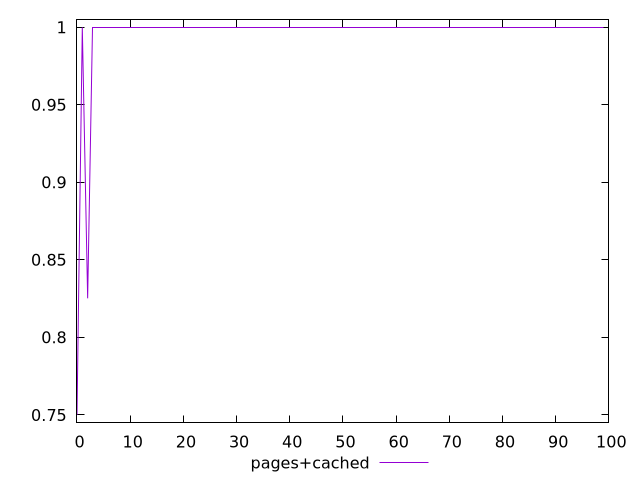
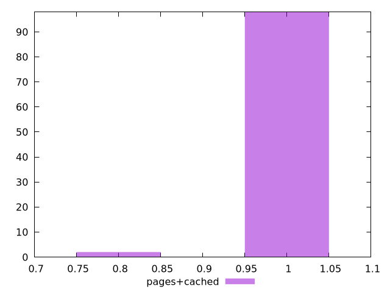
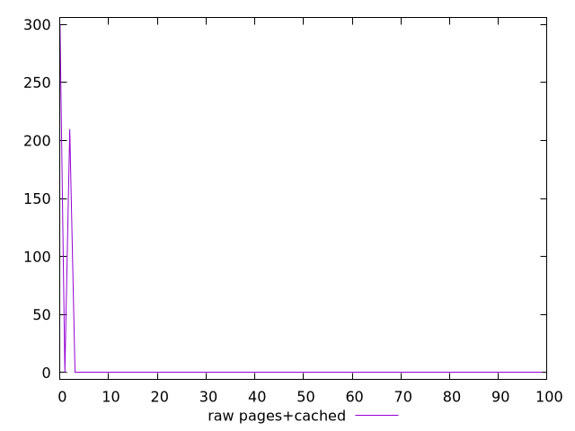
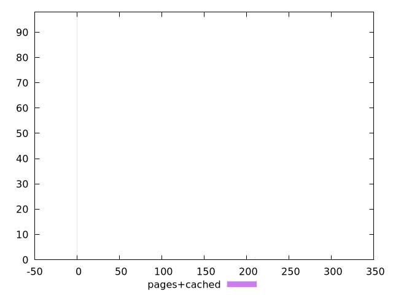

# Report pages+cached

[parent..](./..)  


## Scores

  

## Score Histogram

  

## Score Indicators

```yaml
min: 0.75
max: 1
range: 0.25
mean: 0.9957514999945958
median: 1
stdev: 0.030210519270510952
skewness: -7.180980485739687

```

## Raw Values

  

## Raw Values Histogram

  

## Raw Indicators

```yaml
min: 0
max: 300
range: 300
mean: 5.098200006484985
median: 0
stdev: 36.252623124613145
skewness: 7.180980485739688

```

<style>
  img {
    max-width: 80%;
  }
</style>
      
