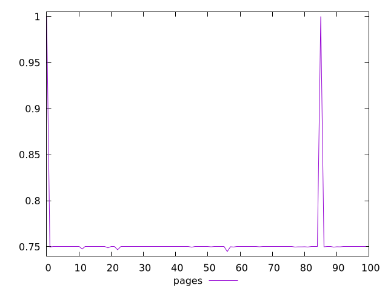
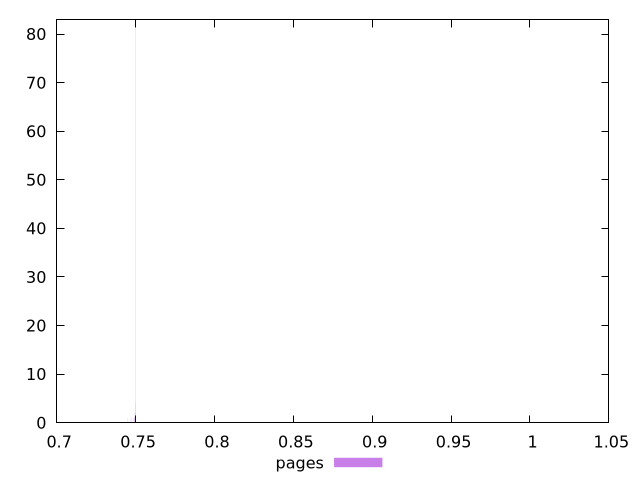
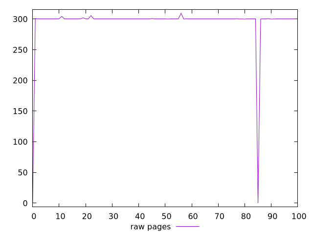
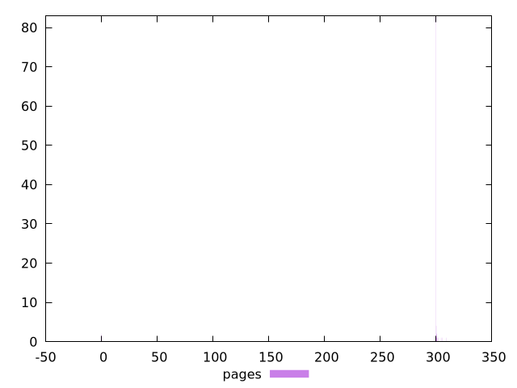

# Report pages

[parent..](./..)  


## Scores

  

## Score Histogram

  

## Score Indicators

```yaml
min: 0.7447911111111111
max: 1
range: 0.25520888888888893
mean: 0.7548498777777779
median: 0.75
stdev: 0.03502774031010241
skewness: 6.853252690199149

```

## Raw Values

  

## Raw Values Histogram

  

## Raw Indicators

```yaml
min: 0
max: 309.376
range: 309.376
mean: 294.27022
median: 300
stdev: 42.055590301309564
skewness: -6.848355070984402

```

<style>
  img {
    max-width: 80%;
  }
</style>
      
