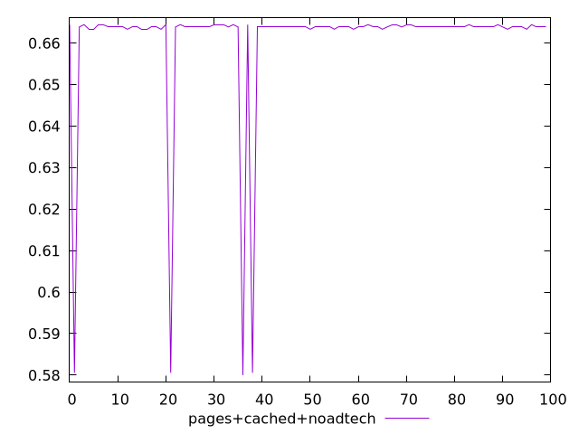
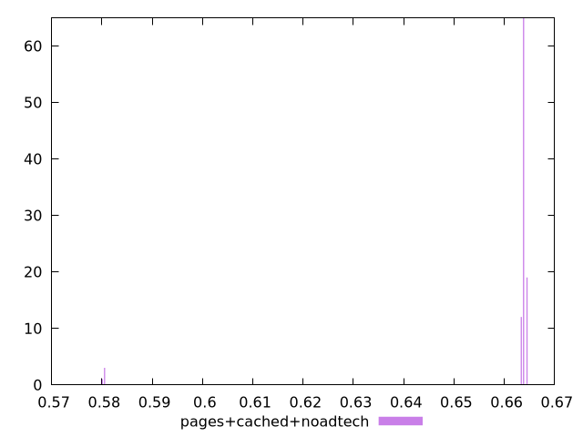
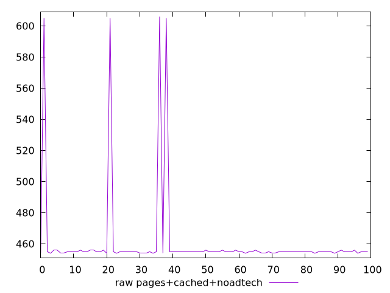
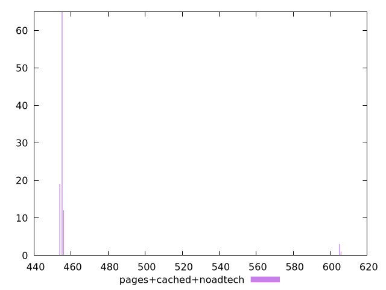

# Report pages+cached+noadtech

[parent..](./..)  


## Scores

  

## Score Histogram

  

## Score Indicators

```yaml
min: 0.58
max: 0.6644444444444444
range: 0.08444444444444443
mean: 0.6605888888888893
median: 0.6638888888888889
stdev: 0.016368031926160292
skewness: -4.6922330733949655

```

## Raw Values

  

## Raw Values Histogram

  

## Raw Indicators

```yaml
min: 454
max: 606
range: 152
mean: 460.94
median: 455
stdev: 29.46245746708852
skewness: 4.692233073394879

```

<style>
  img {
    max-width: 80%;
  }
</style>
      
