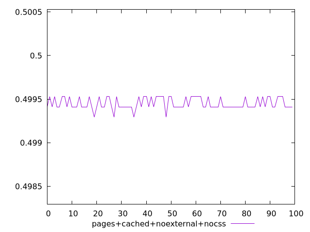
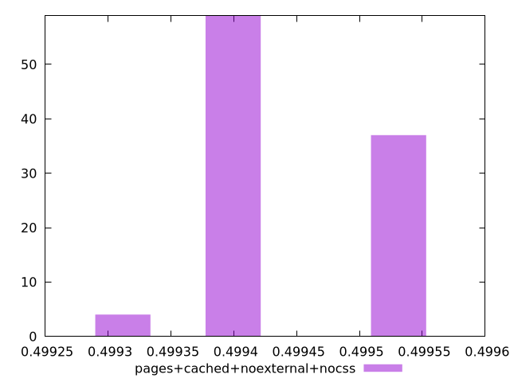
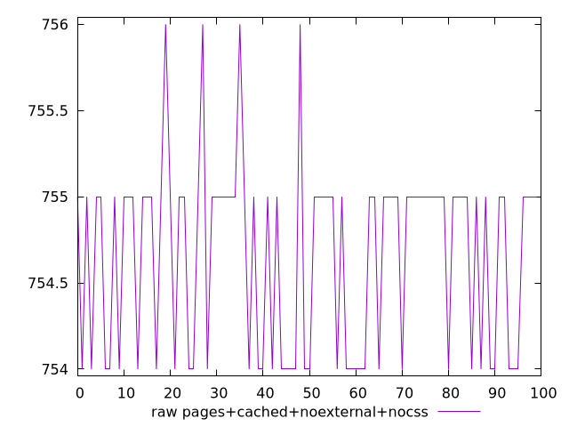
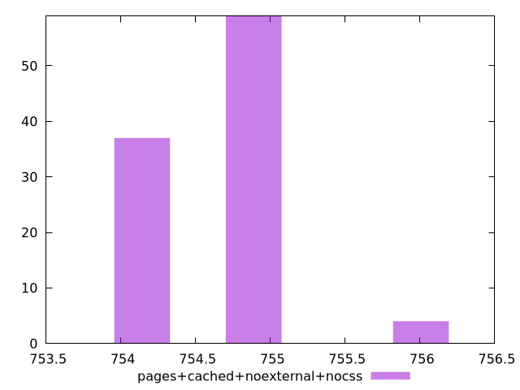

# Report pages+cached+noexternal+nocss

[parent..](./..)  


## Scores

  

## Score Histogram

  

## Score Indicators

```yaml
min: 0.49929411764705883
max: 0.4995294117647059
range: 0.00023529411764705577
mean: 0.49945058823529415
median: 0.49941176470588233
stdev: 0.00006455597608621584
skewness: -0.024367312743344714

```

## Raw Values

  

## Raw Values Histogram

  

## Raw Indicators

```yaml
min: 754
max: 756
range: 2
mean: 754.67
median: 755
stdev: 0.5487257967327578
skewness: 0.02436731274231132

```

<style>
  img {
    max-width: 80%;
  }
</style>
      
