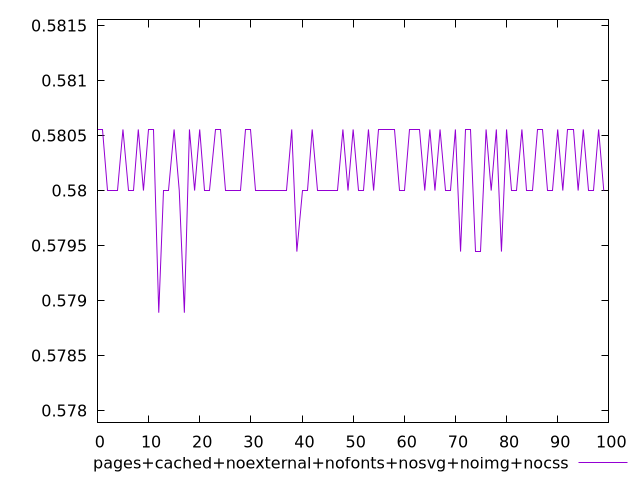
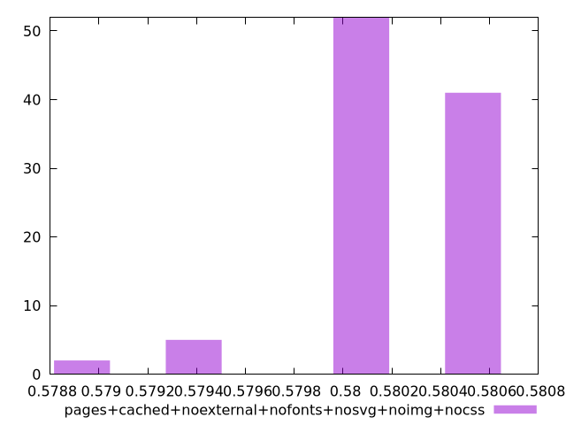
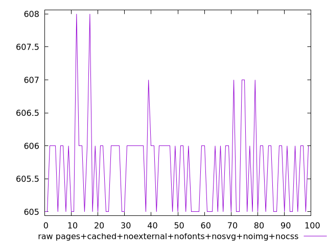
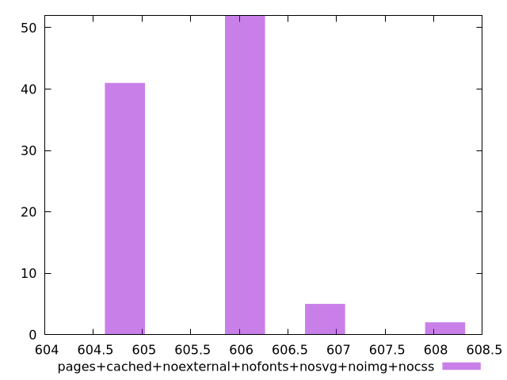

# Report pages+cached+noexternal+nofonts+nosvg+noimg+nocss

[parent..](./..)  


## Scores

  

## Score Histogram

  

## Score Indicators

```yaml
min: 0.5788888888888889
max: 0.5805555555555555
range: 0.0016666666666665941
mean: 0.5801777777777772
median: 0.58
stdev: 0.0003675074535231226
skewness: -0.8735163407363458

```

## Raw Values

  

## Raw Values Histogram

  

## Raw Indicators

```yaml
min: 605
max: 608
range: 3
mean: 605.68
median: 606
stdev: 0.6615134163416487
skewness: 0.8735163407406006

```

<style>
  img {
    max-width: 80%;
  }
</style>
      
