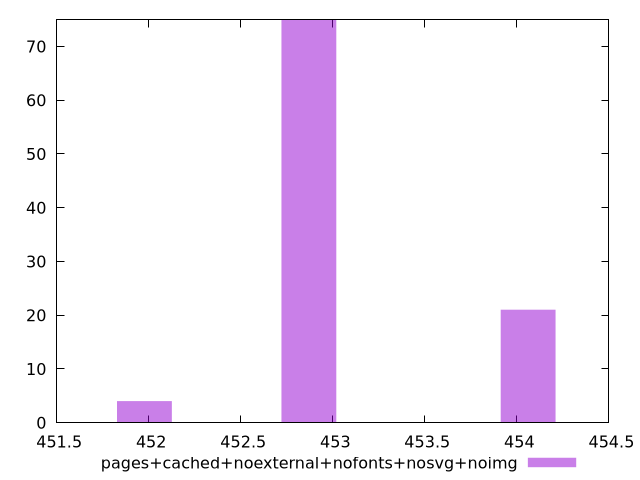

# Report pages+cached+noexternal+nofonts+nosvg+noimg

[parent..](./..)  


## Scores

  

## Score Histogram

  

## Score Indicators

```yaml
min: 0.6644444444444444
max: 0.6655555555555556
range: 0.0011111111111111738
mean: 0.6649055555555549
median: 0.665
stdev: 0.00026122928767800173
skewness: -0.503308683184237

```

## Raw Values

  

## Raw Values Histogram

  

## Raw Indicators

```yaml
min: 452
max: 454
range: 2
mean: 453.17
median: 453
stdev: 0.47021271782034935
skewness: 0.5033086831919675

```

<style>
  img {
    max-width: 80%;
  }
</style>
      
