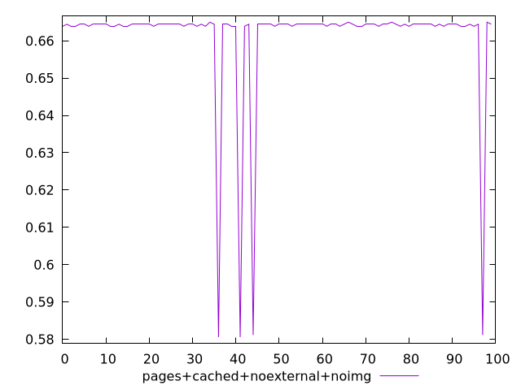
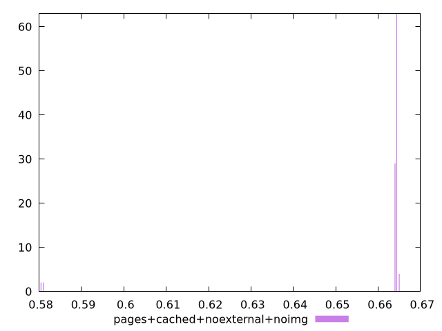
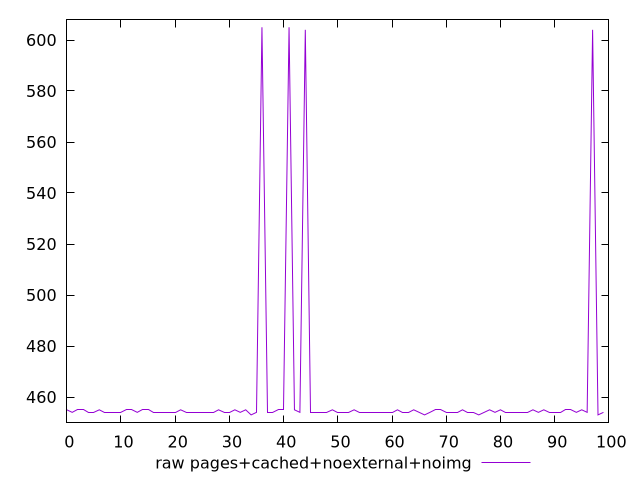
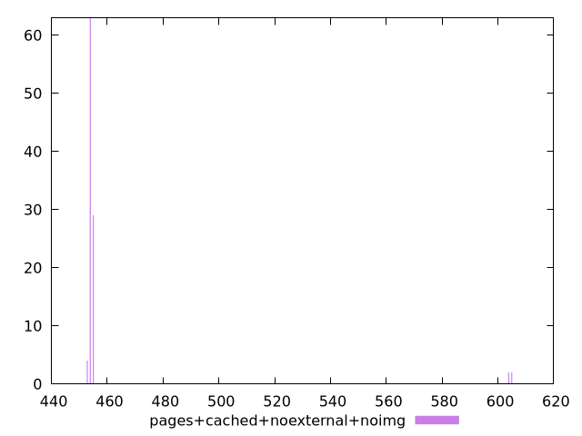

# Report pages+cached+noexternal+noimg

[parent..](./..)  


## Scores

  

## Score Histogram

  

## Score Indicators

```yaml
min: 0.5805555555555555
max: 0.665
range: 0.08444444444444454
mean: 0.6609611111111107
median: 0.6644444444444444
stdev: 0.016358607618311424
skewness: -4.692606188984317

```

## Raw Values

  

## Raw Values Histogram

  

## Raw Indicators

```yaml
min: 453
max: 605
range: 152
mean: 460.27
median: 454
stdev: 29.445493712960573
skewness: 4.6926061889843895

```

<style>
  img {
    max-width: 80%;
  }
</style>
      
