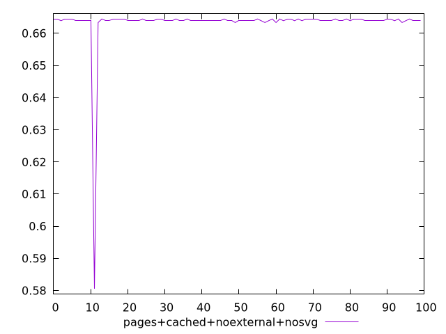
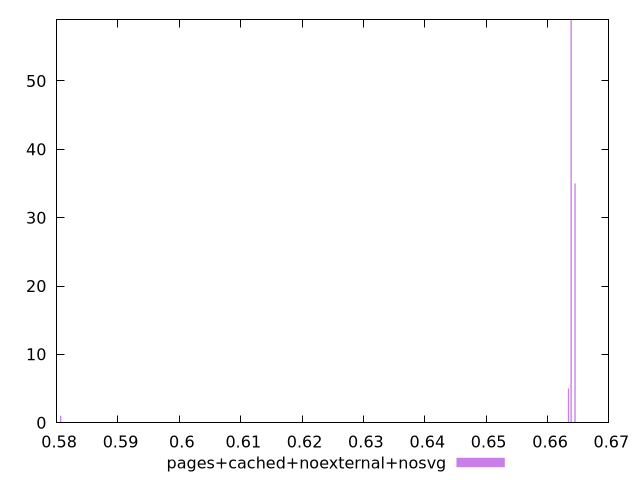
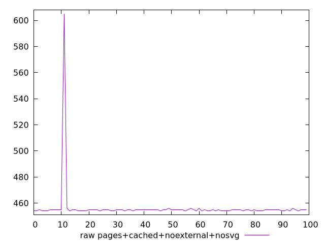
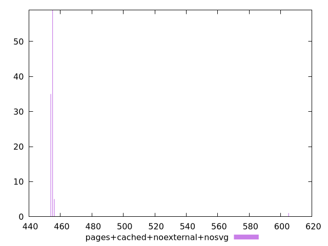

# Report pages+cached+noexternal+nosvg

[parent..](./..)  


## Scores

  

## Score Histogram

  

## Score Indicators

```yaml
min: 0.5805555555555555
max: 0.6644444444444444
range: 0.0838888888888889
mean: 0.6632222222222226
median: 0.6638888888888889
stdev: 0.008314051767346863
skewness: -9.8285744212481

```

## Raw Values

  

## Raw Values Histogram

  

## Raw Indicators

```yaml
min: 454
max: 605
range: 151
mean: 456.2
median: 455
stdev: 14.965293181224347
skewness: 9.82857442124795

```

<style>
  img {
    max-width: 80%;
  }
</style>
      
