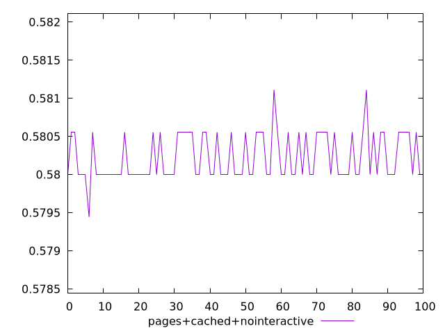
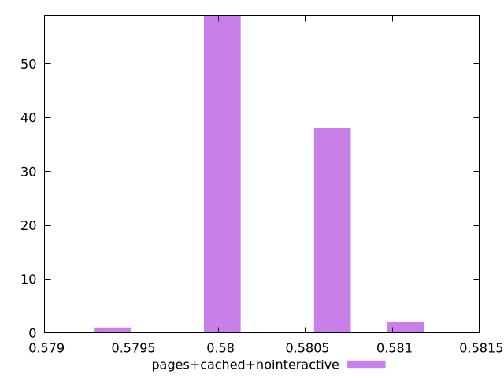
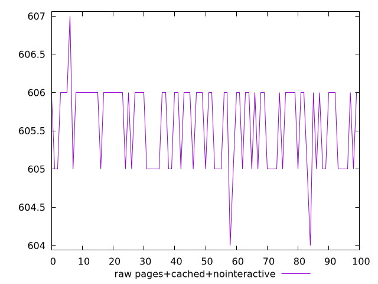
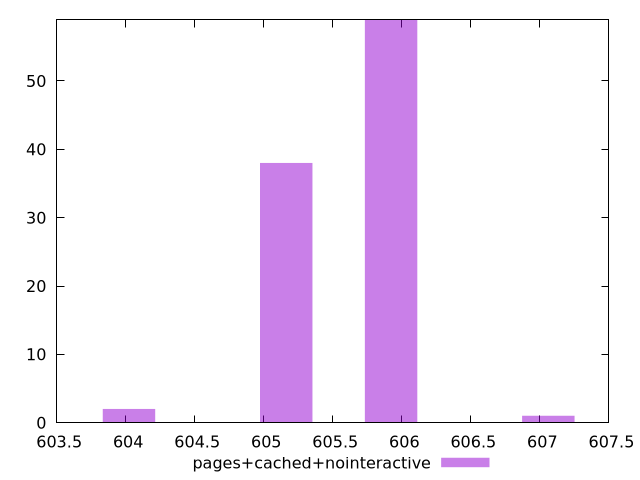

# Report pages+cached+nointeractive

[parent..](./..)  


## Scores

  

## Score Histogram

  

## Score Indicators

```yaml
min: 0.5794444444444444
max: 0.5811111111111111
range: 0.0016666666666667052
mean: 0.580227777777777
median: 0.58
stdev: 0.00030525237484035184
skewness: 0.5410047453893848

```

## Raw Values

  

## Raw Values Histogram

  

## Raw Indicators

```yaml
min: 604
max: 607
range: 3
mean: 605.59
median: 606
stdev: 0.5494542747126463
skewness: -0.5410047453823481

```

<style>
  img {
    max-width: 80%;
  }
</style>
      
