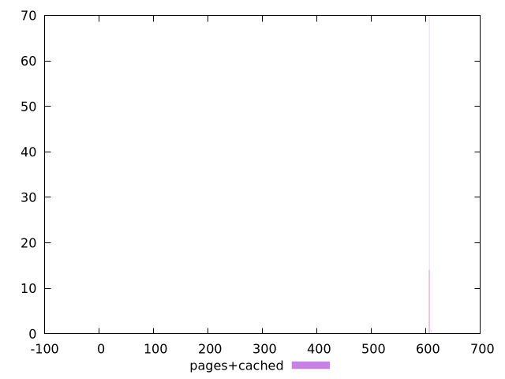

# Report pages+cached

[parent..](./..)  


## Scores

  

## Score Histogram

  

## Score Indicators

```yaml
min: 0.5783333333333334
max: 1
range: 0.42166666666666663
mean: 0.5841833333333327
median: 0.58
stdev: 0.041792510330836634
skewness: 9.848386797987022

```

## Raw Values

  

## Raw Values Histogram

  

## Raw Indicators

```yaml
min: 0
max: 609
range: 609
mean: 599.97
median: 606
stdev: 60.30231421761523
skewness: -9.847839383218917

```

<style>
  img {
    max-width: 80%;
  }
</style>
      
