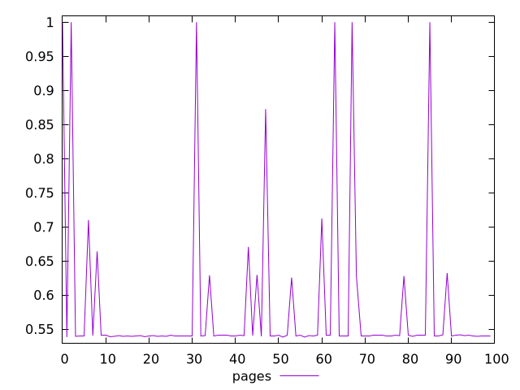
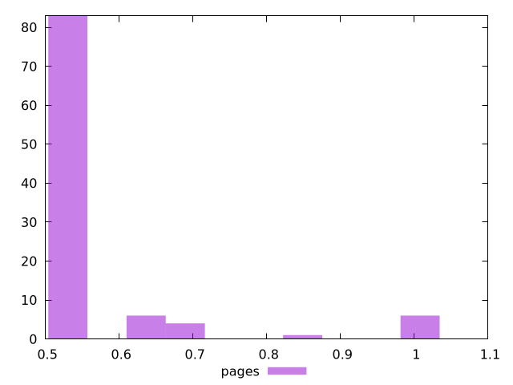
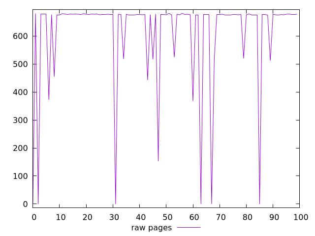
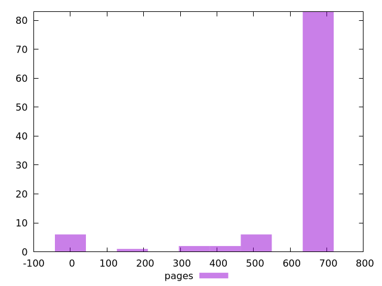

# Report pages

[parent..](./..)  


## Scores

  

## Score Histogram

  

## Score Indicators

```yaml
min: 0.5383333333333333
max: 1
range: 0.46166666666666667
mean: 0.5825361111111111
median: 0.5405555555555556
stdev: 0.11564473491908818
skewness: 2.9791141165326342

```

## Raw Values

  

## Raw Values Histogram

  

## Raw Indicators

```yaml
min: 0
max: 681
range: 681
mean: 611.17
median: 677
stdev: 174.2038492686083
skewness: -2.8058293049277183

```

<style>
  img {
    max-width: 80%;
  }
</style>
      
