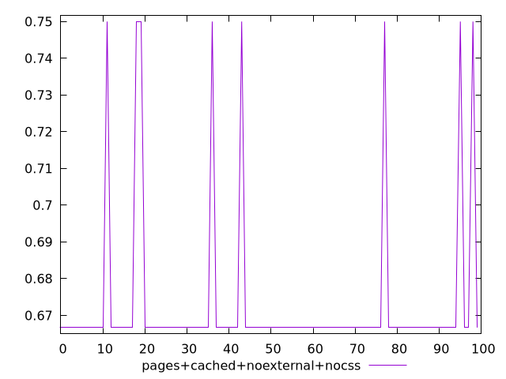
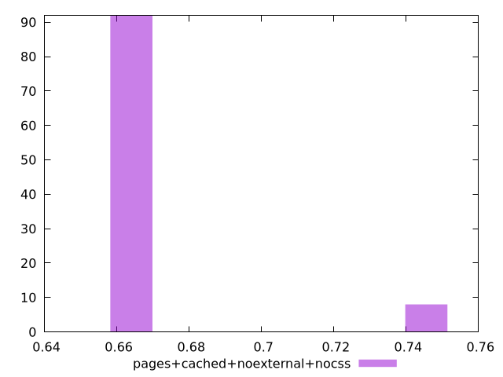
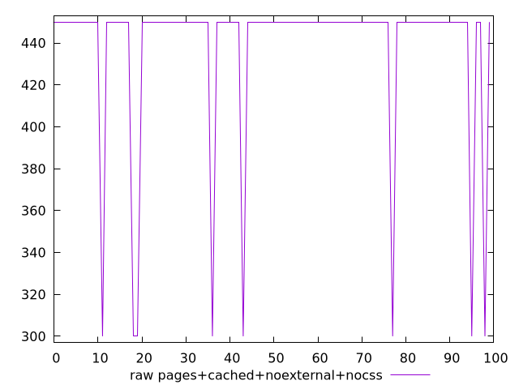
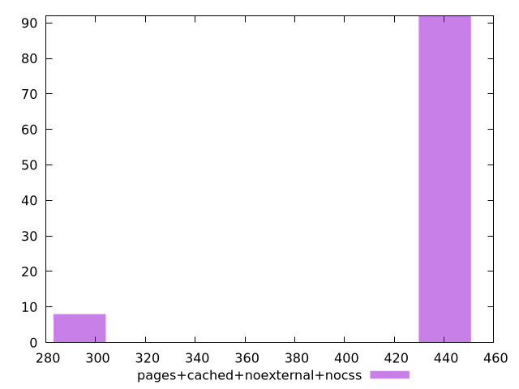

# Report pages+cached+noexternal+nocss

[parent..](./..)  


## Scores

  

## Score Histogram

  

## Score Indicators

```yaml
min: 0.6666666666666666
max: 0.75
range: 0.08333333333333337
mean: 0.6733333333333327
median: 0.6666666666666666
stdev: 0.022607766610417582
skewness: 3.0962810792529183

```

## Raw Values

  

## Raw Values Histogram

  

## Raw Indicators

```yaml
min: 300
max: 450
range: 150
mean: 438
median: 450
stdev: 40.69397989875161
skewness: -3.0962810792528432

```

<style>
  img {
    max-width: 80%;
  }
</style>
      
