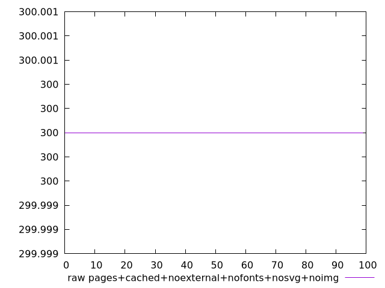
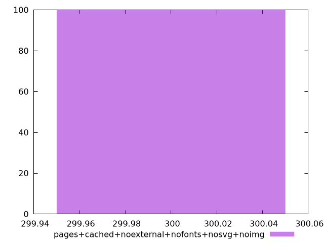

# Report pages+cached+noexternal+nofonts+nosvg+noimg

[parent..](./..)  


## Scores

  

## Score Histogram

  

## Score Indicators

```yaml
min: 0.75
max: 0.75
range: 0
mean: 0.75
median: 0.75
stdev: 0
skewness: .nan

```

## Raw Values

  

## Raw Values Histogram

  

## Raw Indicators

```yaml
min: 300
max: 300
range: 0
mean: 300
median: 300
stdev: 0
skewness: .nan

```

<style>
  img {
    max-width: 80%;
  }
</style>
      
