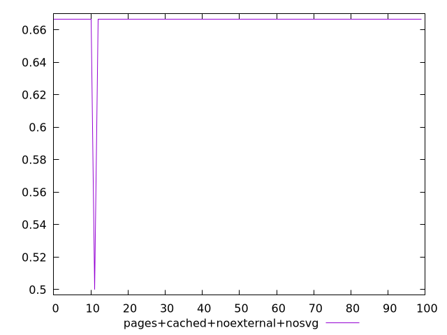
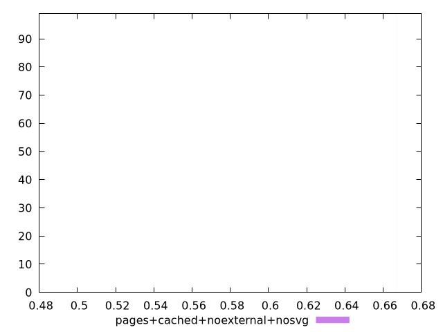
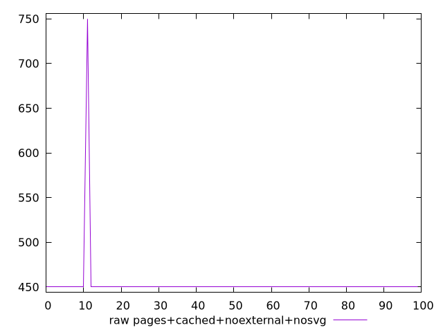
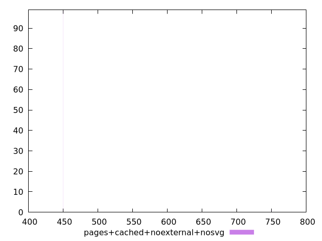

# Report pages+cached+noexternal+nosvg

[parent..](./..)  


## Scores

  

## Score Histogram

  

## Score Indicators

```yaml
min: 0.5
max: 0.6666666666666666
range: 0.16666666666666663
mean: 0.6649999999999993
median: 0.6666666666666666
stdev: 0.016583123951776992
skewness: -9.849370589540186

```

## Raw Values

  

## Raw Values Histogram

  

## Raw Indicators

```yaml
min: 450
max: 750
range: 300
mean: 453
median: 450
stdev: 29.8496231131986
skewness: 9.849370589540309

```

<style>
  img {
    max-width: 80%;
  }
</style>
      
