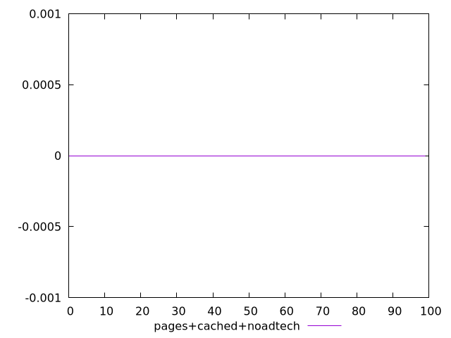

# Report pages+cached+noadtech

[parent..](./..)  


## Scores

  

## Score Histogram

  

## Score Indicators

```yaml
min: 0
max: 0
range: 0
mean: 0
median: 0
stdev: 0
skewness: .nan

```

## Raw Values

  

## Raw Values Histogram

  

## Raw Indicators

```yaml
min: 27450
max: 27610
range: 160
mean: 27499.6
median: 27450
stdev: 70.68125635555721
skewness: 0.72372191456802

```

<style>
  img {
    max-width: 80%;
  }
</style>
      
