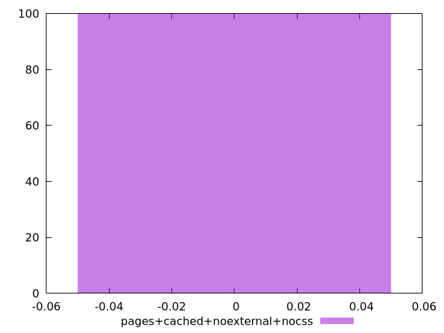

# Report pages+cached+noexternal+nocss

[parent..](./..)  


## Scores

  

## Score Histogram

  

## Score Indicators

```yaml
min: 0
max: 0
range: 0
mean: 0
median: 0
stdev: 0
skewness: .nan

```

## Raw Values

  

## Raw Values Histogram

  

## Raw Indicators

```yaml
min: 27600
max: 27610
range: 10
mean: 27600.1
median: 27600
stdev: 0.9949874371066194
skewness: 9.849370589544675

```

<style>
  img {
    max-width: 80%;
  }
</style>
      
