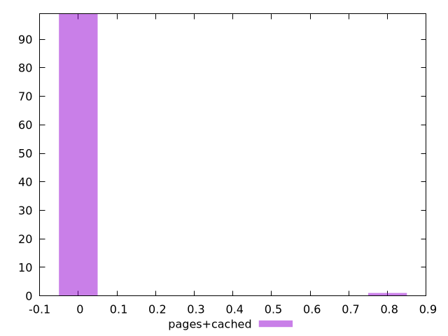
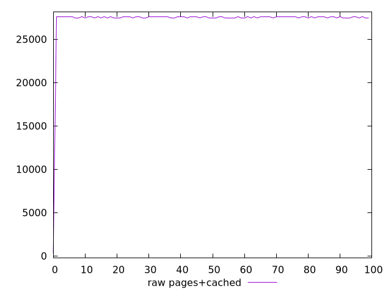
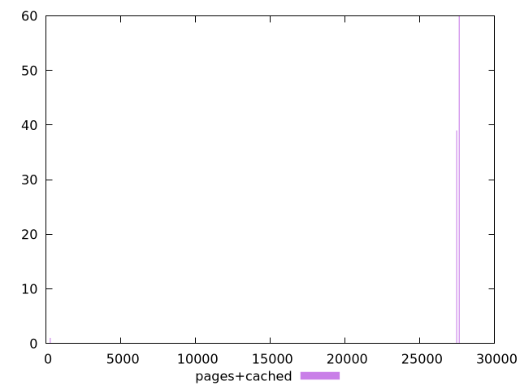

# Report pages+cached

[parent..](./..)  


## Scores

  

## Score Histogram

  

## Score Indicators

```yaml
min: 0
max: 0.75
range: 0.75
mean: 0.0075
median: 0
stdev: 0.07462405778299651
skewness: 9.849370589540312

```

## Raw Values

  

## Raw Values Histogram

  

## Raw Indicators

```yaml
min: 300
max: 27600
range: 27300
mean: 27268.6
median: 27600
stdev: 2711.42398750177
skewness: -9.83851089077826

```

<style>
  img {
    max-width: 80%;
  }
</style>
      
