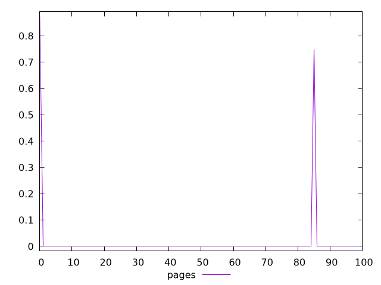
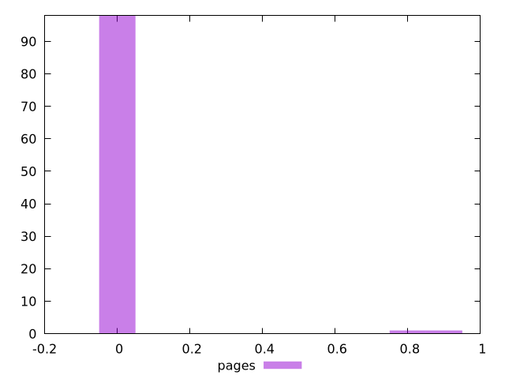
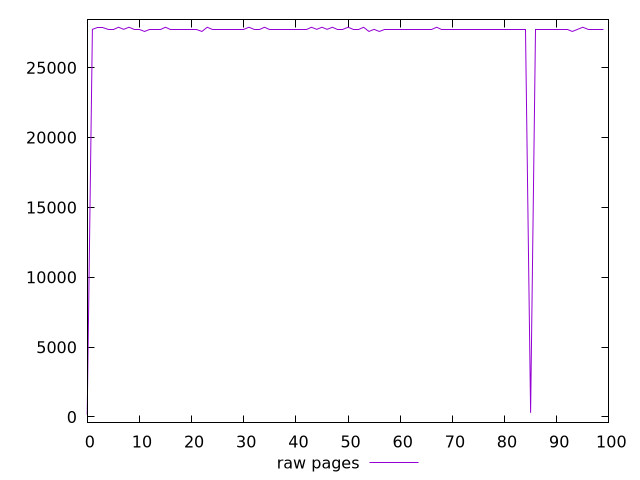
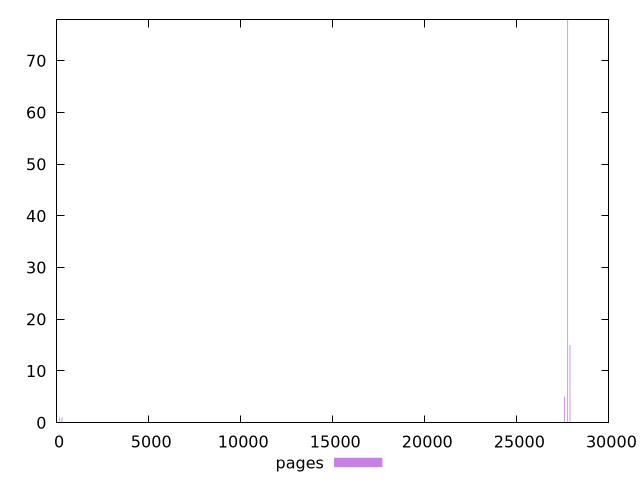

# Report pages

[parent..](./..)  


## Scores

  

## Score Histogram

  

## Score Indicators

```yaml
min: 0
max: 0.875
range: 0.875
mean: 0.01625
median: 0
stdev: 0.11409288978722555
skewness: 6.921160511663917

```

## Raw Values

  

## Raw Values Histogram

  

## Raw Indicators

```yaml
min: 150
max: 27900
range: 27750
mean: 27214.5
median: 27750
stdev: 3856.211191052689
skewness: -6.8541448451497935

```

<style>
  img {
    max-width: 80%;
  }
</style>
      
