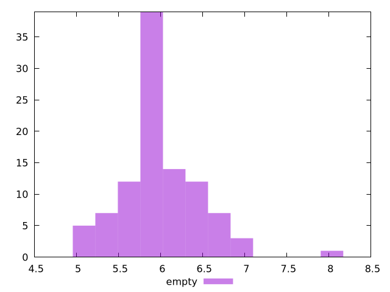

# Report empty

[parent..](./..)  


## Scores

  

## Score Histogram

  

## Score Indicators

```yaml
min: 0.9999999999999953
max: 1
range: 4.6629367034256575e-15
mean: 0.9999999999999999
median: 0.9999999999999998
stdev: 5.370542509574172e-16
skewness: -6.4330208713083925

```

## Raw Values

  

## Raw Values Histogram

  

## Raw Indicators

```yaml
min: 5.048000000000001
max: 8.056000000000001
range: 3.008
mean: 5.98784
median: 5.898000000000001
stdev: 0.4735655122578079
skewness: 0.8928519078042908

```

<style>
  img {
    max-width: 80%;
  }
</style>
      
