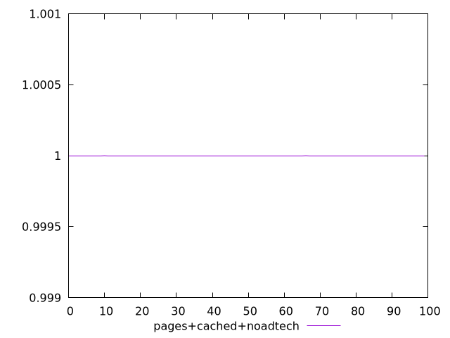
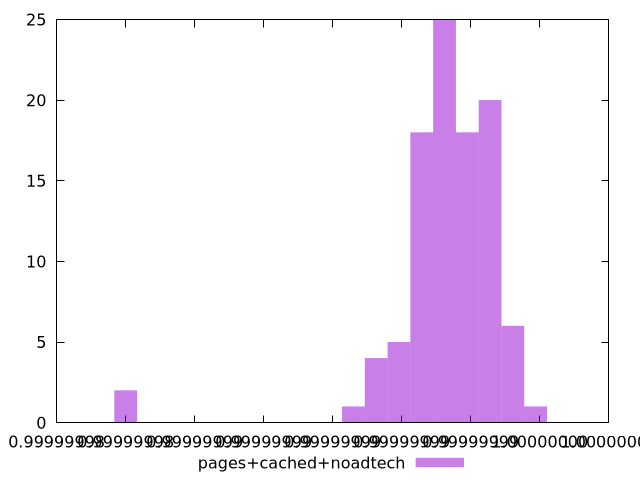
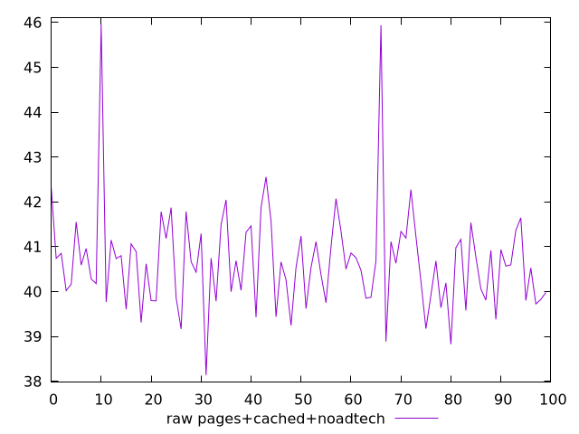
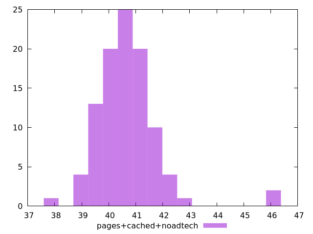

# Report pages+cached+noadtech

[parent..](./..)  


## Scores

  

## Score Histogram

  

## Score Indicators

```yaml
min: 0.9999999838431521
max: 0.999999995947132
range: 1.210397981843414e-8
mean: 0.9999999932993464
median: 0.9999999934567922
stdev: 1.6790584381408e-9
skewness: -3.487510434166191

```

## Raw Values

  

## Raw Values Histogram

  

## Raw Indicators

```yaml
min: 38.135999999999996
max: 45.952
range: 7.8160000000000025
mean: 40.669200000000004
median: 40.64599999999999
stdev: 1.1280288648789083
skewness: 1.854992932895548

```

<style>
  img {
    max-width: 80%;
  }
</style>
      
