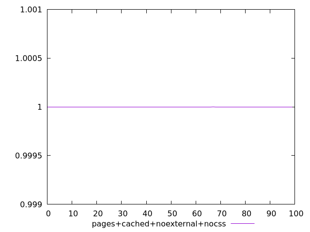
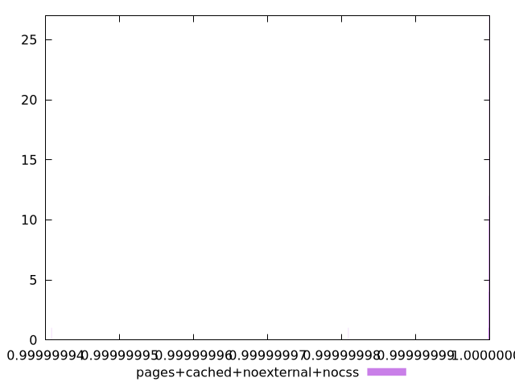
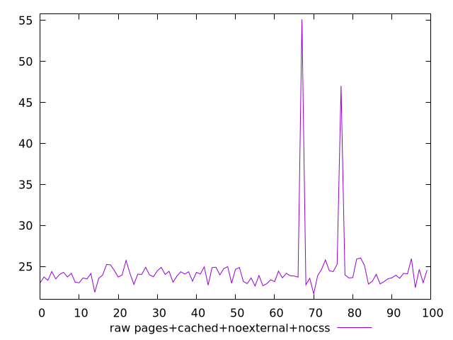
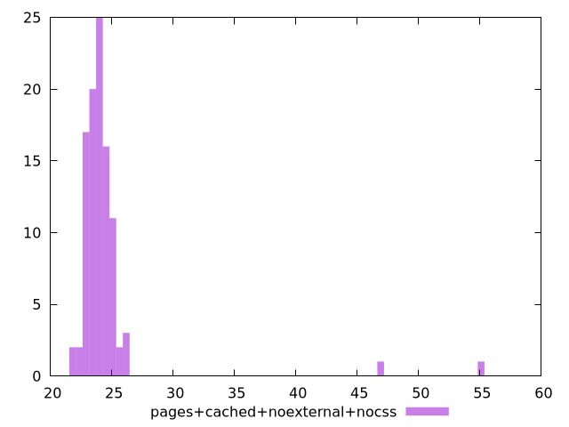

# Report pages+cached+noexternal+nocss

[parent..](./..)  


## Scores

  

## Score Histogram

  

## Score Indicators

```yaml
min: 0.999999940810661
max: 0.9999999999563964
range: 5.9145735420429446e-8
mean: 0.999999999114383
median: 0.9999999998980478
stdev: 6.157350859639606e-9
skewness: -8.74724748787171

```

## Raw Values

  

## Raw Values Histogram

  

## Raw Indicators

```yaml
min: 21.663999999999994
max: 55.13599999999998
range: 33.47199999999999
mean: 24.485199999999995
median: 23.97399999999999
stdev: 3.9348372876143154
skewness: 6.586722354833448

```

<style>
  img {
    max-width: 80%;
  }
</style>
      
