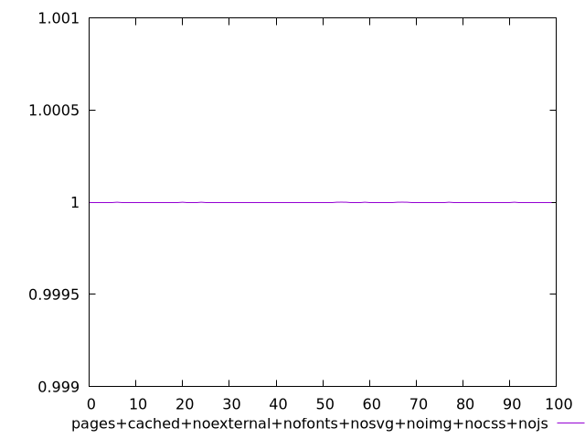
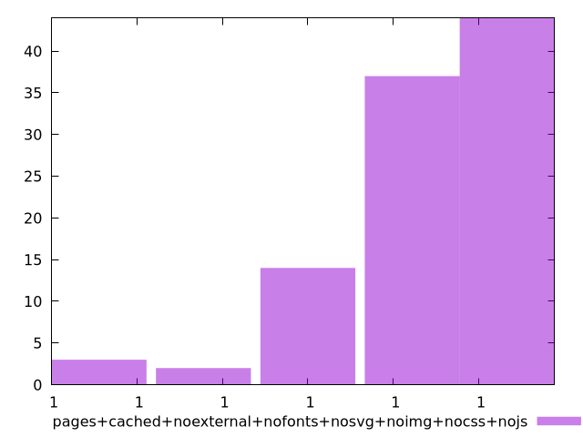
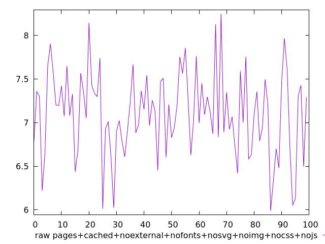
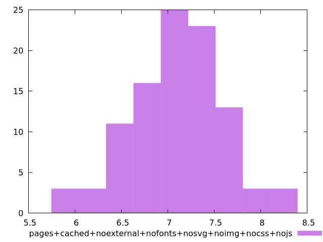

# Report pages+cached+noexternal+nofonts+nosvg+noimg+nocss+nojs

[parent..](./..)  


## Scores

  

## Score Histogram

  

## Score Indicators

```yaml
min: 0.9999999999999942
max: 0.9999999999999998
range: 5.551115123125783e-15
mean: 0.9999999999999996
median: 0.9999999999999987
stdev: 1.557362355075173e-15
skewness: -1.9080345478132659

```

## Raw Values

  

## Raw Values Histogram

  

## Raw Indicators

```yaml
min: 5.988000000000001
max: 8.248
range: 2.259999999999998
mean: 7.10388
median: 7.114000000000002
stdev: 0.48334714812440954
skewness: -0.1565182276627031

```

<style>
  img {
    max-width: 80%;
  }
</style>
      
