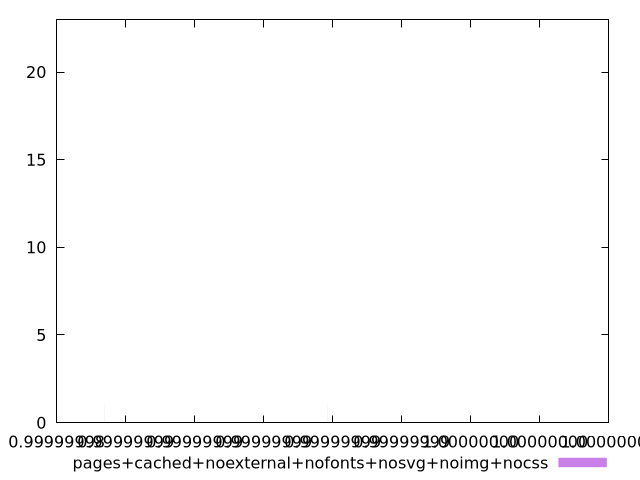

# Report pages+cached+noexternal+nofonts+nosvg+noimg+nocss

[parent..](./..)  


## Scores

  

## Score Histogram

  

## Score Indicators

```yaml
min: 0.9999999853928606
max: 0.999999999997939
range: 1.460507836892333e-8
mean: 0.9999999997629679
median: 0.9999999999905091
stdev: 1.6553213578050693e-9
skewness: -7.627749077755043

```

## Raw Values

  

## Raw Values Histogram

  

## Raw Indicators

```yaml
min: 15.279999999999994
max: 45.31999999999999
range: 30.04
mean: 18.59031999999999
median: 18.14599999999999
stdev: 3.6643973225620603
skewness: 6.413797564648654

```

<style>
  img {
    max-width: 80%;
  }
</style>
      
