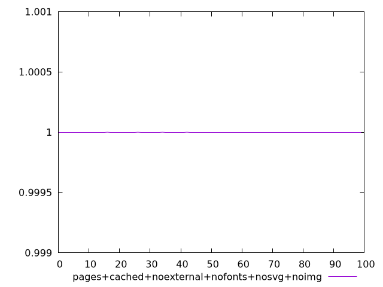
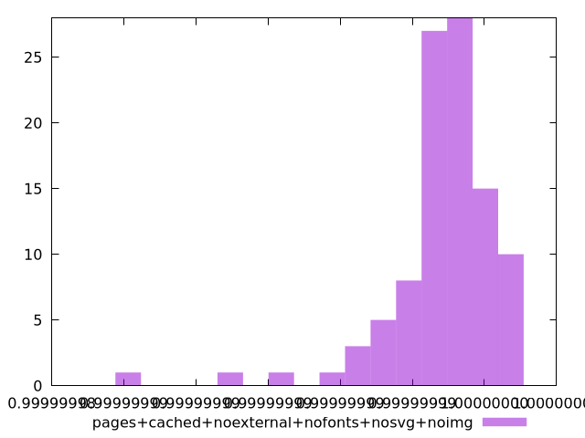
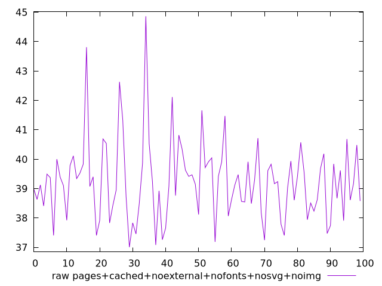
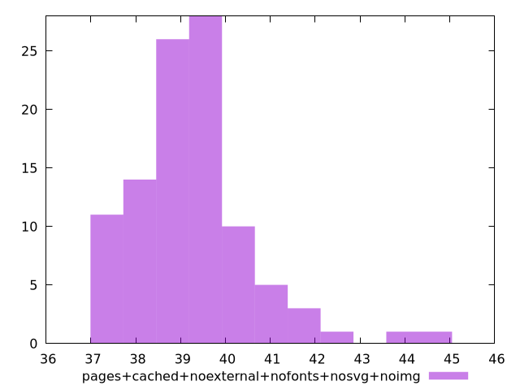

# Report pages+cached+noexternal+nofonts+nosvg+noimg

[parent..](./..)  


## Scores

  

## Score Histogram

  

## Score Indicators

```yaml
min: 0.9999999864323506
max: 0.9999999967756054
range: 1.034325480819831e-8
mean: 0.99999999482418
median: 0.9999999950426994
stdev: 1.545747210823111e-9
skewness: -2.489205134251474

```

## Raw Values

  

## Raw Values Histogram

  

## Raw Indicators

```yaml
min: 37.00399999999999
max: 44.86399999999999
range: 7.859999999999999
mean: 39.23863999999999
median: 39.16799999999999
stdev: 1.343158214954589
skewness: 1.1914843572695408

```

<style>
  img {
    max-width: 80%;
  }
</style>
      
