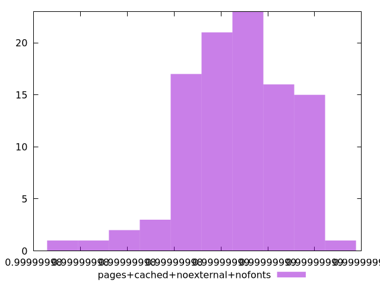

# Report pages+cached+noexternal+nofonts

[parent..](./..)  


## Scores

  

## Score Histogram

  

## Score Indicators

```yaml
min: 0.9999999798445154
max: 0.9999999904727711
range: 1.0628255719957735e-8
mean: 0.9999999866920954
median: 0.9999999867777978
stdev: 2.1288000483129163e-9
skewness: -0.5551182239419505

```

## Raw Values

  

## Raw Values Histogram

  

## Raw Indicators

```yaml
min: 42.755999999999986
max: 47.37599999999999
range: 4.6200000000000045
mean: 44.68175999999998
median: 44.706
stdev: 0.964331448413874
skewness: 0.2137751055347727

```

<style>
  img {
    max-width: 80%;
  }
</style>
      
