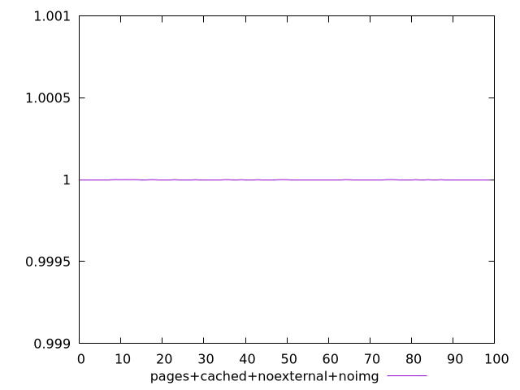
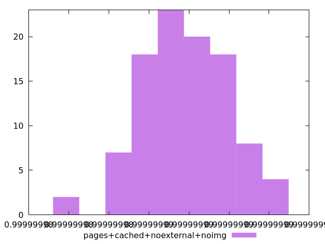
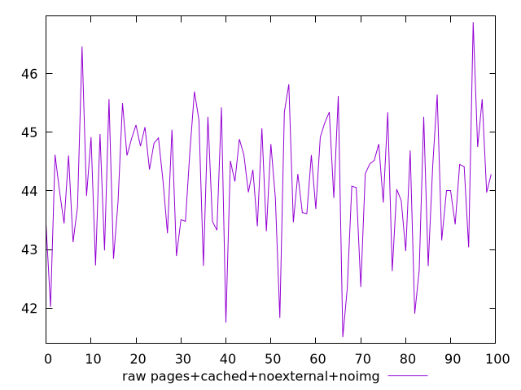
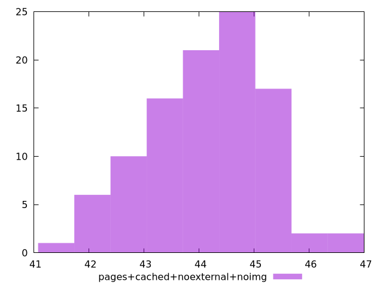

# Report pages+cached+noexternal+noimg

[parent..](./..)  


## Scores

  

## Score Histogram

  

## Score Indicators

```yaml
min: 0.999999981321321
max: 0.9999999923553813
range: 1.1034060332093532e-8
mean: 0.9999999878113057
median: 0.9999999877741538
stdev: 2.1064848212616154e-9
skewness: -0.1640995278072786

```

## Raw Values

  

## Raw Values Histogram

  

## Raw Indicators

```yaml
min: 41.50399999999999
max: 46.879999999999995
range: 5.376000000000005
mean: 44.135160000000006
median: 44.230000000000004
stdev: 1.05832249073711
skewness: -0.23831869983210732

```

<style>
  img {
    max-width: 80%;
  }
</style>
      
