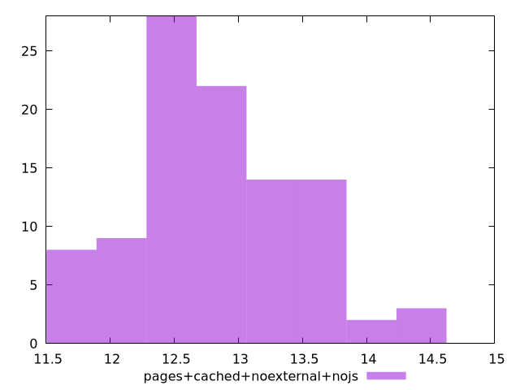

# Report pages+cached+noexternal+nojs

[parent..](./..)  


## Scores

  

## Score Histogram

  

## Score Indicators

```yaml
min: 0.9999999999987718
max: 0.9999999999998437
range: 1.0719203302755886e-12
mean: 0.9999999999995489
median: 0.9999999999996072
stdev: 2.1645976600127853e-13
skewness: -1.2998856359283293

```

## Raw Values

  

## Raw Values Histogram

  

## Raw Indicators

```yaml
min: 11.56
max: 14.432000000000002
range: 2.8720000000000017
mean: 12.819079999999994
median: 12.752000000000002
stdev: 0.6188598174061714
skewness: 0.37319865649048345

```

<style>
  img {
    max-width: 80%;
  }
</style>
      
