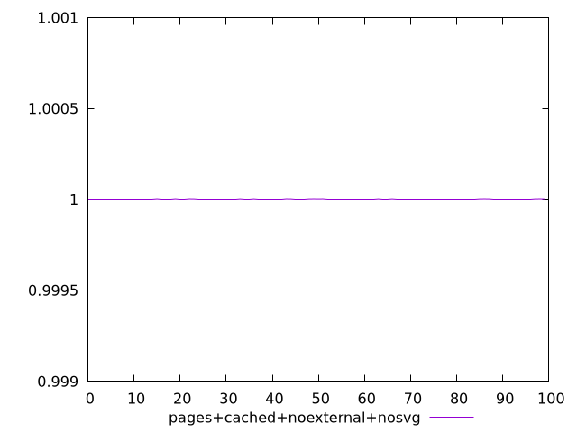
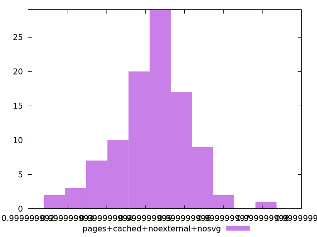
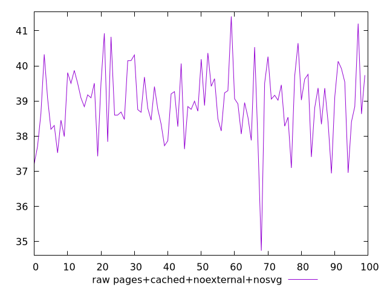
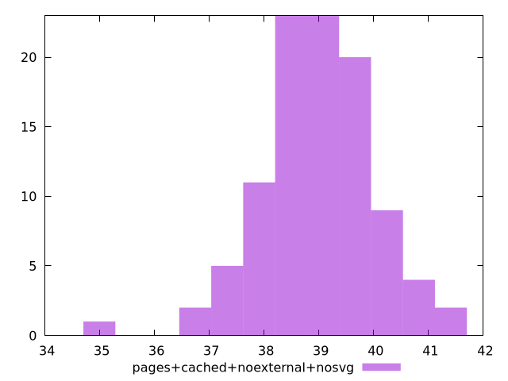

# Report pages+cached+noexternal+nosvg

[parent..](./..)  


## Scores

  

## Score Histogram

  

## Score Indicators

```yaml
min: 0.9999999924858389
max: 0.9999999980123638
range: 5.5265249043756626e-9
mean: 0.9999999951660129
median: 0.9999999952226755
stdev: 9.244420650633409e-10
skewness: -0.25258570557496246

```

## Raw Values

  

## Raw Values Histogram

  

## Raw Indicators

```yaml
min: 34.73999999999999
max: 41.40799999999999
range: 6.667999999999999
mean: 38.954679999999996
median: 38.975999999999985
stdev: 1.0205291262869478
skewness: -0.5214544965564974

```

<style>
  img {
    max-width: 80%;
  }
</style>
      
