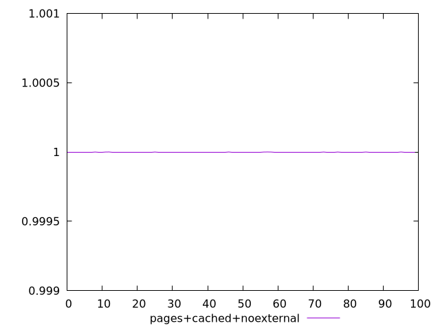
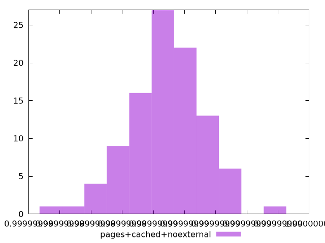
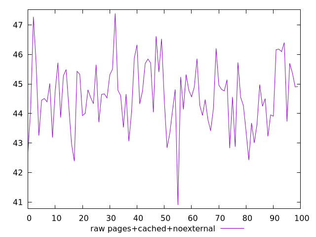
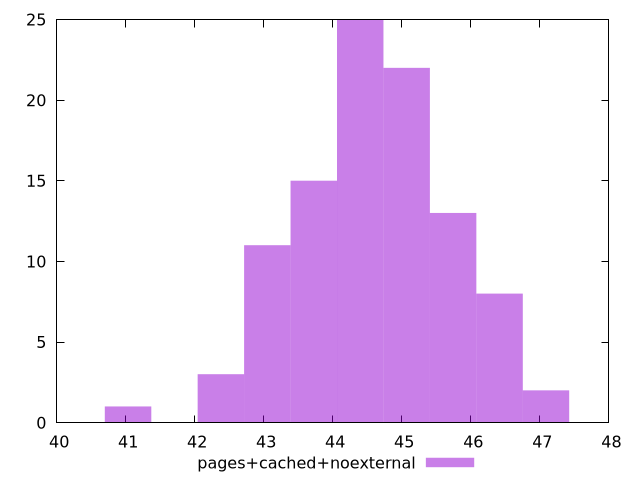

# Report pages+cached+noexternal

[parent..](./..)  


## Scores

  

## Score Histogram

  

## Score Indicators

```yaml
min: 0.9999999798076187
max: 0.999999993140584
range: 1.3332965287382592e-8
mean: 0.9999999868442816
median: 0.9999999870904848
stdev: 2.3739482632734645e-9
skewness: -0.3608791195030996

```

## Raw Values

  

## Raw Values Histogram

  

## Raw Indicators

```yaml
min: 40.903999999999996
max: 47.387999999999984
range: 6.4839999999999876
mean: 44.591759999999994
median: 44.559999999999995
stdev: 1.1095252779454823
skewness: -0.16186684566728501

```

<style>
  img {
    max-width: 80%;
  }
</style>
      
