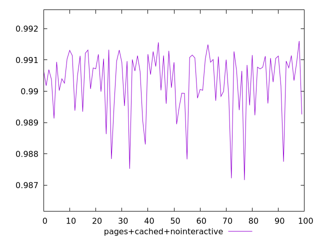
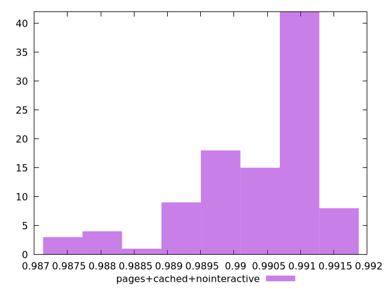
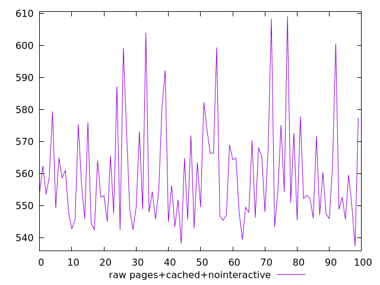
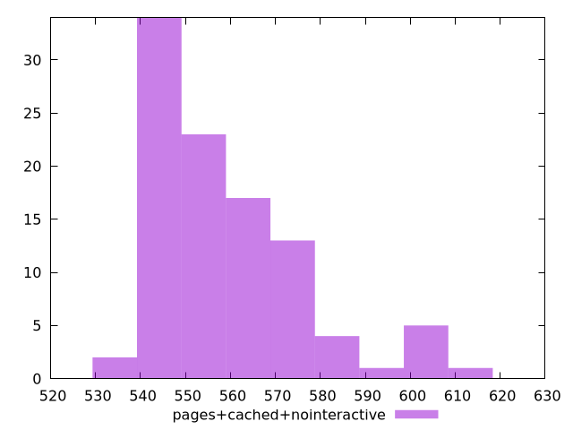

# Report pages+cached+nointeractive

[parent..](./..)  


## Scores

  

## Score Histogram

  

## Score Indicators

```yaml
min: 0.9871620137564372
max: 0.9916049734548162
range: 0.004442959698379045
mean: 0.9903231005896528
median: 0.9906730423337797
stdev: 0.0009987582470198104
skewness: -1.3429351545853807

```

## Raw Values

  

## Raw Values Histogram

  

## Raw Indicators

```yaml
min: 537.2680000000001
max: 609.1360000000004
range: 71.86800000000028
mean: 559.4153200000004
median: 553.8980000000004
stdev: 16.361741873578094
skewness: 1.2116185466404326

```

<style>
  img {
    max-width: 80%;
  }
</style>
      
