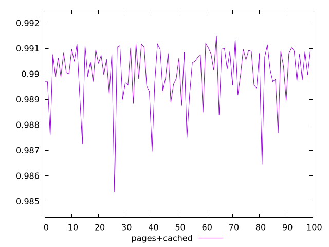
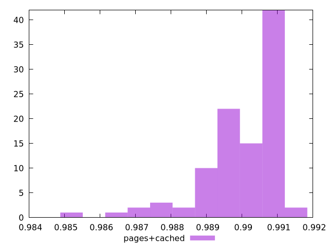
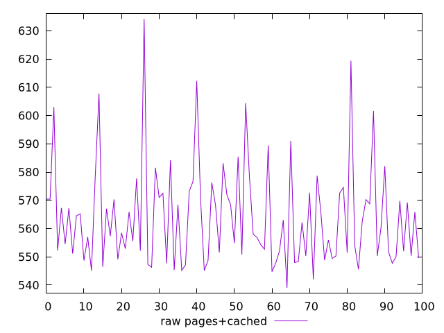
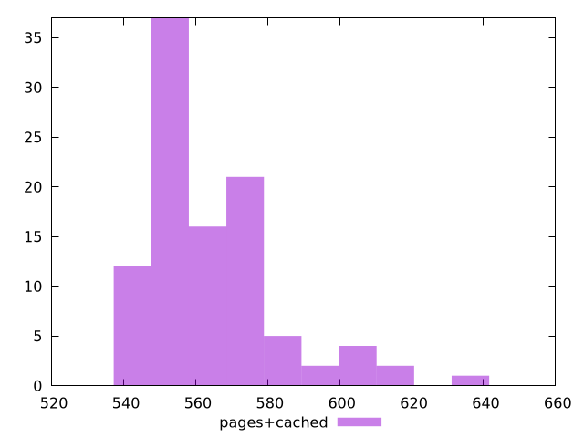

# Report pages+cached

[parent..](./..)  


## Scores

  

## Score Histogram

  

## Score Indicators

```yaml
min: 0.9853582826323097
max: 0.9915086288772049
range: 0.0061503462448951884
mean: 0.9900394866387819
median: 0.9903524160733471
stdev: 0.0011273164812508445
skewness: -1.5949168207491584

```

## Raw Values

  

## Raw Values Histogram

  

## Raw Indicators

```yaml
min: 539.0360000000003
max: 634.1880000000002
range: 95.15199999999993
mean: 564.0884000000004
median: 559.3920000000002
stdev: 18.010567862230197
skewness: 1.3877402368190679

```

<style>
  img {
    max-width: 80%;
  }
</style>
      
