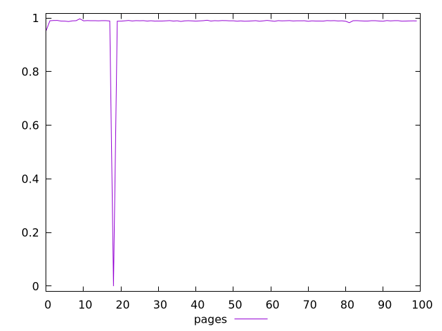
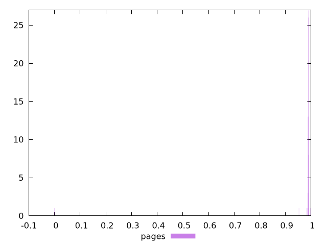
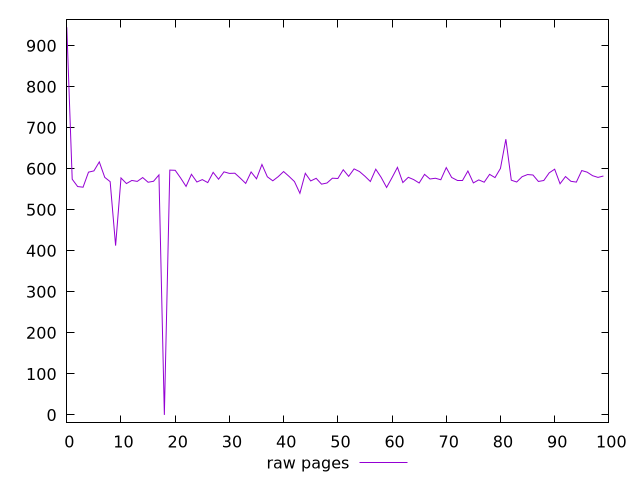
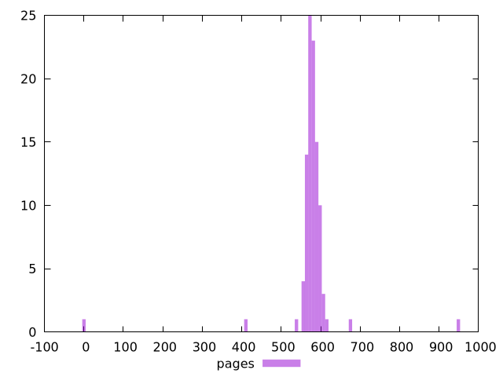

# Report pages

[parent..](./..)  


## Scores

  

## Score Histogram

  

## Score Indicators

```yaml
min: 0
max: 0.9968121998142587
range: 0.9968121998142587
mean: 0.9788832707098394
median: 0.9891830246082306
stdev: 0.09845734463023544
skewness: -9.826646198976004

```

## Raw Values

  

## Raw Values Histogram

  

## Raw Indicators

```yaml
min: 0
max: 945.1600000000008
range: 945.1600000000008
mean: 576.2638800000002
median: 578.1460000000004
stdev: 72.2112330241328
skewness: -3.8367024001428813

```

<style>
  img {
    max-width: 80%;
  }
</style>
      
