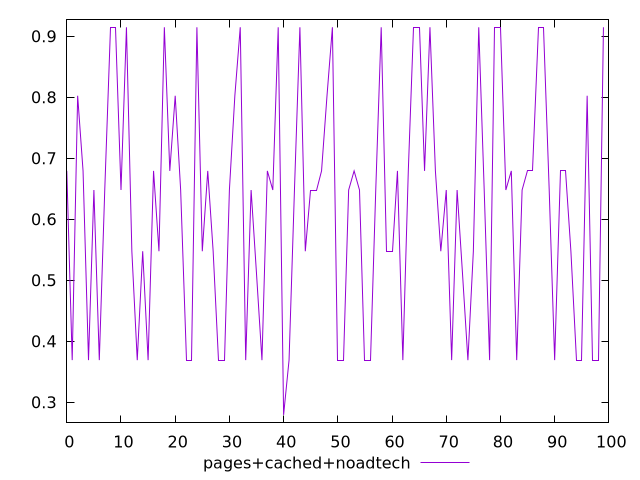
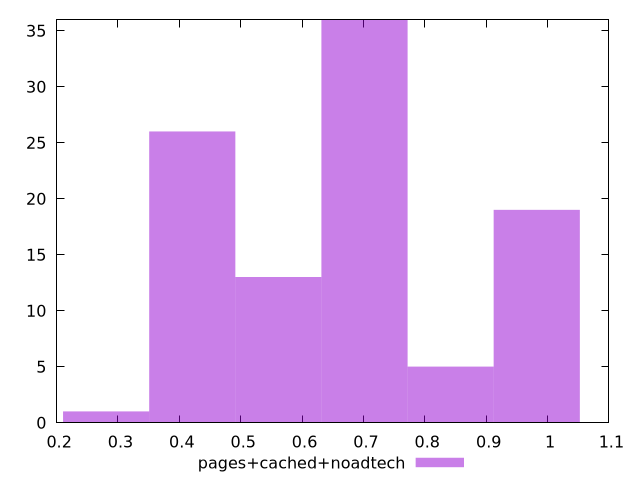
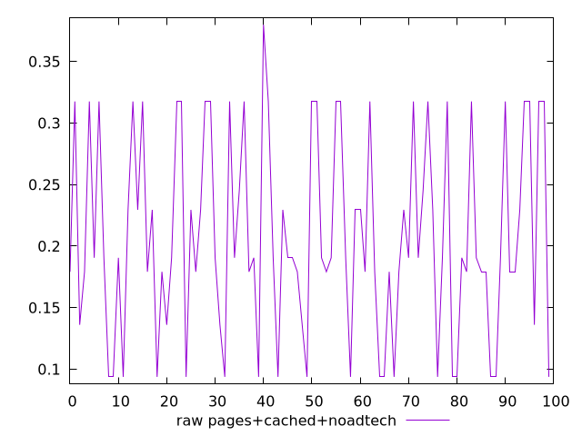

# Report pages+cached+noadtech

[parent..](./..)  


## Scores

  

## Score Histogram

  

## Score Indicators

```yaml
min: 0.27931295209719315
max: 0.9146517814122077
range: 0.6353388293150146
mean: 0.6216700449271795
median: 0.6478936866255779
stdev: 0.19299874617841395
skewness: 0.06194636121752934

```

## Raw Values

  

## Raw Values Histogram

  

## Raw Indicators

```yaml
min: 0.0938739013671875
max: 0.3797997665405274
range: 0.2859258651733399
mean: 0.20781984195709224
median: 0.1905707836151123
stdev: 0.08014478642171233
skewness: 0.17809069607632755

```

<style>
  img {
    max-width: 80%;
  }
</style>
      
