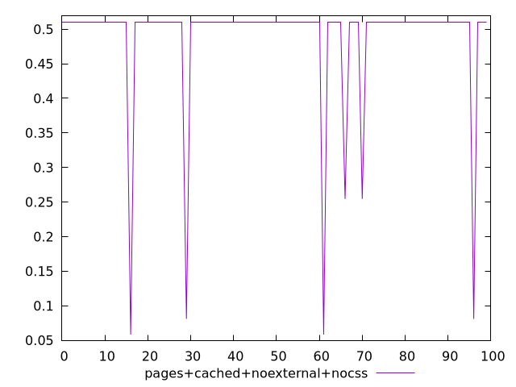
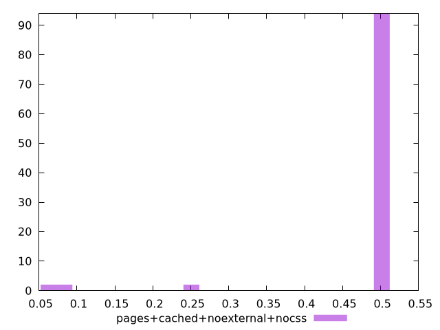
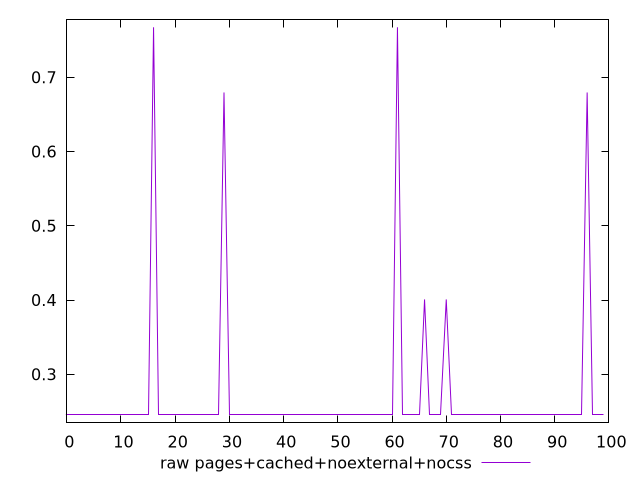
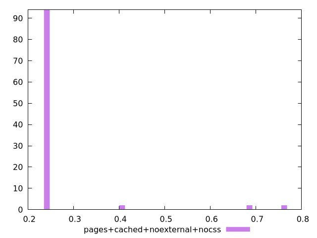

# Report pages+cached+noexternal+nocss

[parent..](./..)  


## Scores

  

## Score Histogram

  

## Score Indicators

```yaml
min: 0.05836683666802267
max: 0.5104268062017119
range: 0.4520599695336892
mean: 0.48767648648233014
median: 0.5104268062017119
stdev: 0.09256913184084496
skewness: -3.9972944662495458

```

## Raw Values

  

## Raw Values Histogram

  

## Raw Indicators

```yaml
min: 0.24537114122178816
max: 0.7674015206231011
range: 0.5220303794013129
mean: 0.2676070210605199
median: 0.24537114122178816
stdev: 0.09597190214679646
skewness: 4.4486424093730355

```

<style>
  img {
    max-width: 80%;
  }
</style>
      
