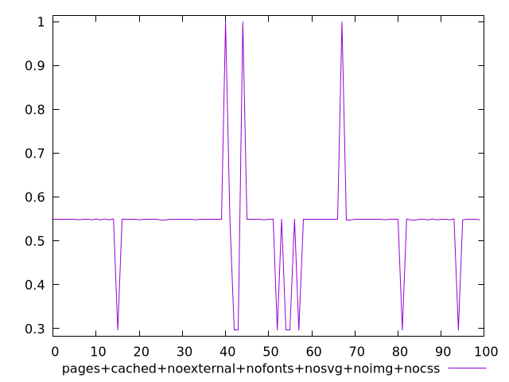
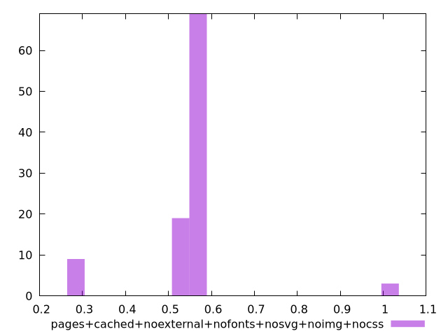
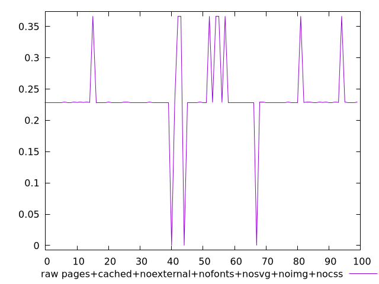
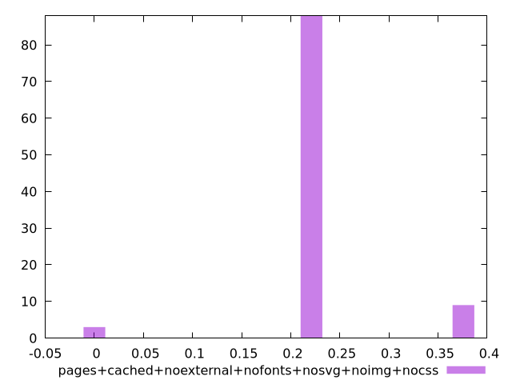

# Report pages+cached+noexternal+nofonts+nosvg+noimg+nocss

[parent..](./..)  


## Scores

  

## Score Histogram

  

## Score Indicators

```yaml
min: 0.2963432211283839
max: 1
range: 0.7036567788716162
mean: 0.540266164432917
median: 0.5499689372766312
stdev: 0.10849785651711763
skewness: 1.260211772904434

```

## Raw Values

  

## Raw Values Histogram

  

## Raw Indicators

```yaml
min: 0
max: 0.3664786512586805
range: 0.3664786512586805
mean: 0.23424622097439204
median: 0.22853081597222222
stdev: 0.0569817230230427
skewness: -0.960248927360952

```

<style>
  img {
    max-width: 80%;
  }
</style>
      
