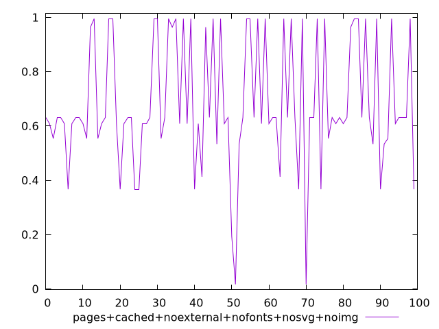
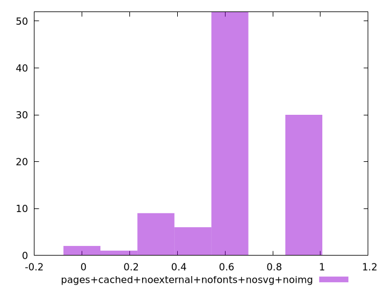
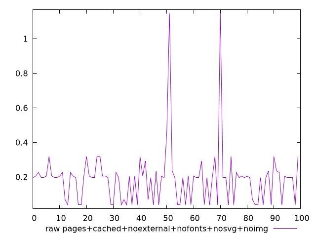
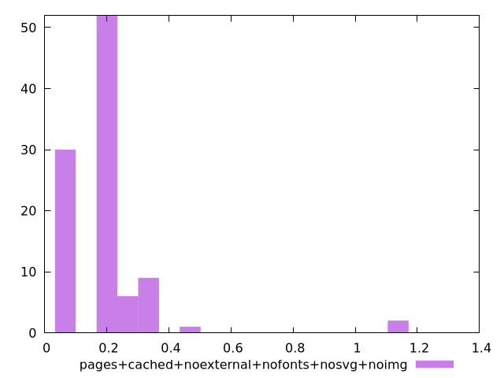

# Report pages+cached+noexternal+nofonts+nosvg+noimg

[parent..](./..)  


## Scores

  

## Score Histogram

  

## Score Indicators

```yaml
min: 0.01659363310226647
max: 0.9953476174851198
range: 0.9787539843828533
mean: 0.6818012707170249
median: 0.6313938914065288
stdev: 0.23213916910448218
skewness: -0.1360559960833392

```

## Raw Values

  

## Raw Values Histogram

  

## Raw Indicators

```yaml
min: 0.0389404296875
max: 1.1462412516276042
range: 1.1073008219401042
mean: 0.1900532240231832
median: 0.19667434692382812
stdev: 0.16577088384649524
skewness: 3.7195888754909934

```

<style>
  img {
    max-width: 80%;
  }
</style>
      
