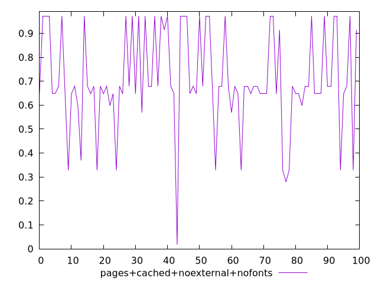
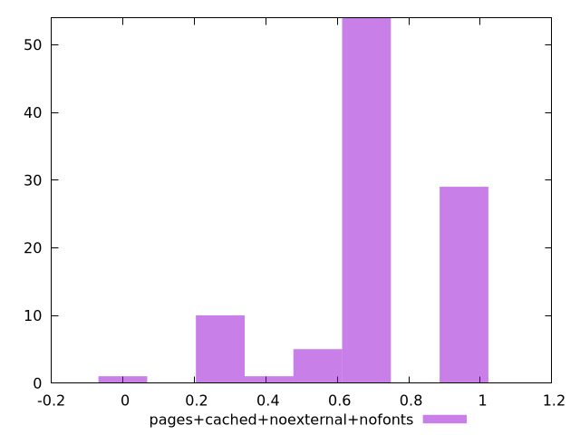
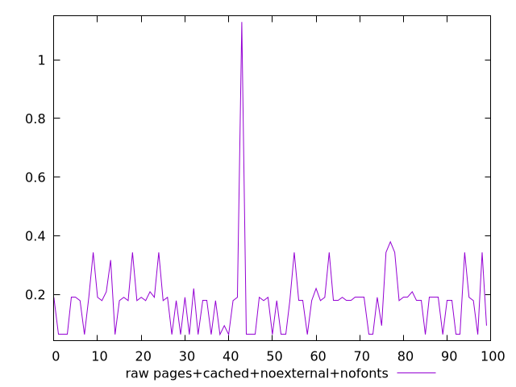
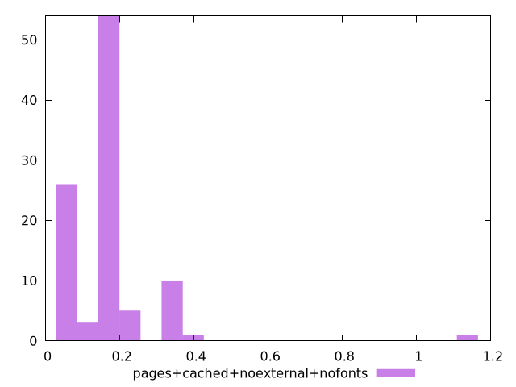

# Report pages+cached+noexternal+nofonts

[parent..](./..)  


## Scores

  

## Score Histogram

  

## Score Indicators

```yaml
min: 0.017481246450500643
max: 0.9721147685558164
range: 0.9546335221053157
mean: 0.7046499070864674
median: 0.6792219852973744
stdev: 0.20502918319984473
skewness: -0.47311569115290664

```

## Raw Values

  

## Raw Values Histogram

  

## Raw Indicators

```yaml
min: 0.0636767578125
max: 1.1291448974609375
range: 1.0654681396484376
mean: 0.17887718210220346
median: 0.17922065734863282
stdev: 0.12582997785229724
skewness: 4.355777333966915

```

<style>
  img {
    max-width: 80%;
  }
</style>
      
