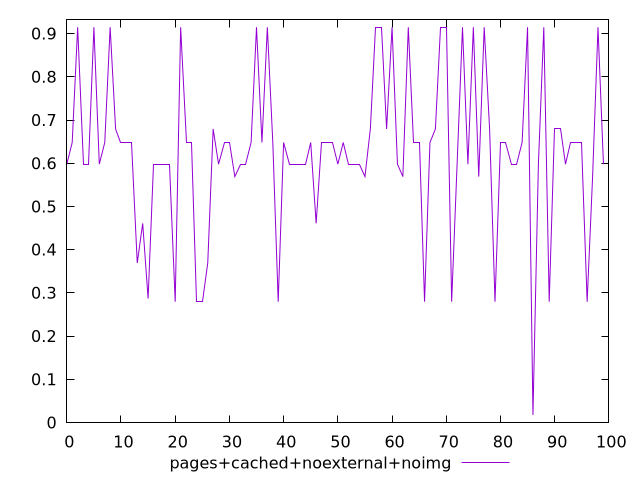
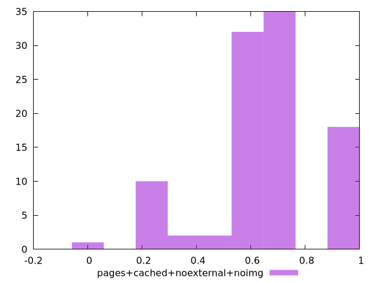
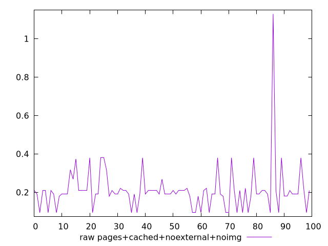
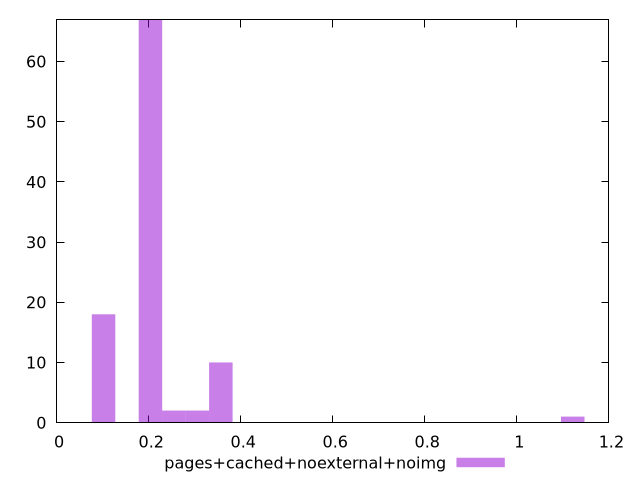

# Report pages+cached+noexternal+noimg

[parent..](./..)  


## Scores

  

## Score Histogram

  

## Score Indicators

```yaml
min: 0.017481246450500643
max: 0.9146517814122077
range: 0.8971705349617071
mean: 0.6285484556799895
median: 0.6478936866255779
stdev: 0.18237665242050424
skewness: -0.45316817493796313

```

## Raw Values

  

## Raw Values Histogram

  

## Raw Indicators

```yaml
min: 0.0938739013671875
max: 1.1291448974609375
range: 1.03527099609375
mean: 0.21119788322448738
median: 0.1905707836151123
stdev: 0.11924826025101437
skewness: 4.683144945189684

```

<style>
  img {
    max-width: 80%;
  }
</style>
      
