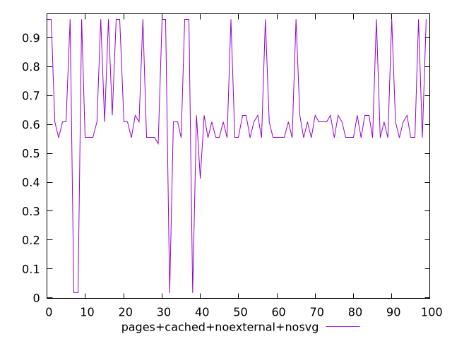
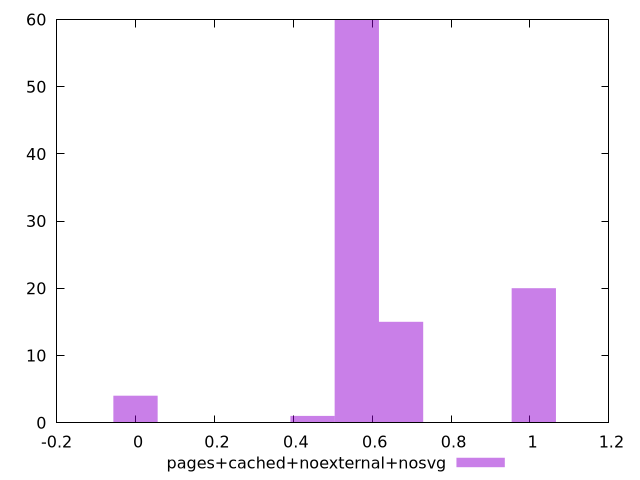
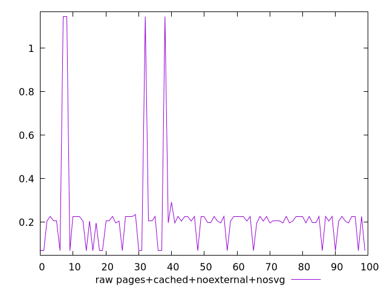
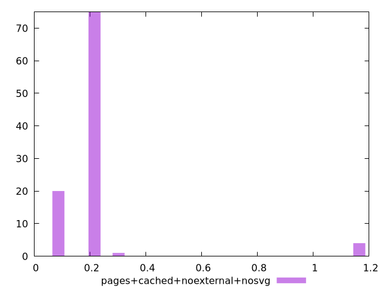

# Report pages+cached+noexternal+nosvg

[parent..](./..)  


## Scores

  

## Score Histogram

  

## Score Indicators

```yaml
min: 0.01659363310226647
max: 0.9638914552234408
range: 0.9472978221211743
mean: 0.6370296331570725
median: 0.6085969600017687
stdev: 0.2001208559164148
skewness: -0.36237884515140595

```

## Raw Values

  

## Raw Values Histogram

  

## Raw Indicators

```yaml
min: 0.0691375732421875
max: 1.1462412516276042
range: 1.0771036783854167
mean: 0.22334761568705247
median: 0.20527796427408854
stdev: 0.19763930084418393
skewness: 3.9777045023652744

```

<style>
  img {
    max-width: 80%;
  }
</style>
      
