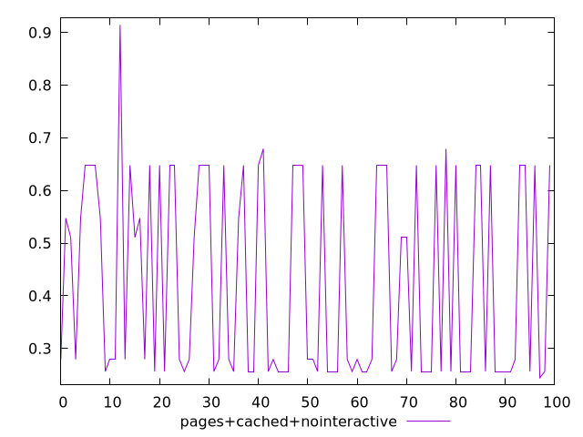
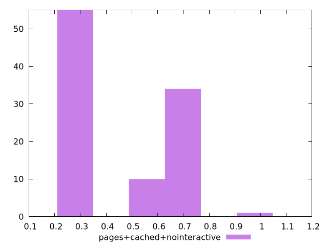
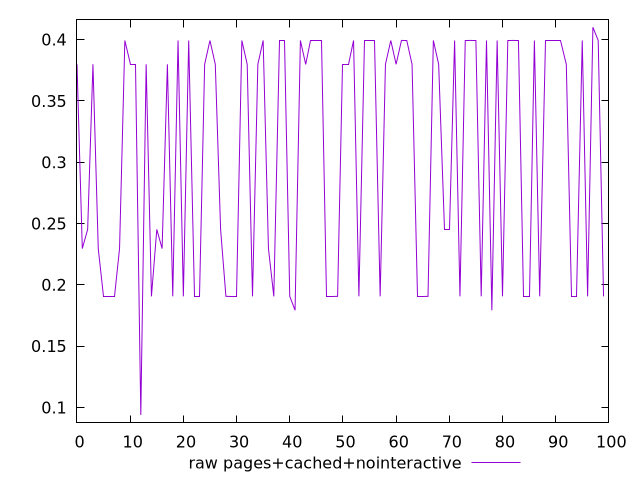
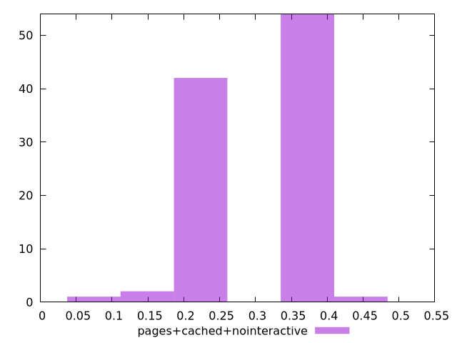

# Report pages+cached+nointeractive

[parent..](./..)  


## Scores

  

## Score Histogram

  

## Score Indicators

```yaml
min: 0.24443907256421127
max: 0.9145679909362433
range: 0.670128918372032
mean: 0.4279189348179824
median: 0.2792823224708178
stdev: 0.18729140938188193
skewness: 0.3824394659854975

```

## Raw Values

  

## Raw Values Histogram

  

## Raw Indicators

```yaml
min: 0.09390992567274305
max: 0.410057782491048
range: 0.316147856818305
mean: 0.30546404058456406
median: 0.37982450612386065
stdev: 0.0986427941052924
skewness: -0.2812262954902477

```

<style>
  img {
    max-width: 80%;
  }
</style>
      
