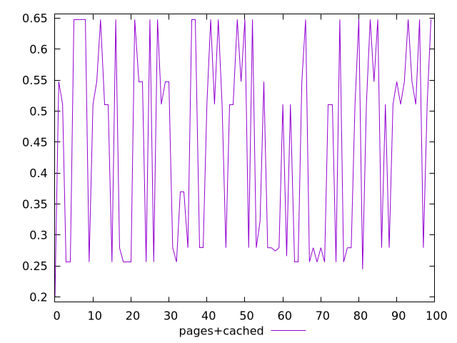

# Report pages+cached

[parent..](./..)  


## Scores

  

## Score Histogram

  

## Score Indicators

```yaml
min: 0.20062807120195092
max: 0.647828950132018
range: 0.4472008789300671
mean: 0.44821110974301503
median: 0.5108242979213455
stdev: 0.1581527824975943
skewness: -0.09152432953107015

```

## Raw Values

  

## Raw Values Histogram

  

## Raw Indicators

```yaml
min: 0.19059454663594563
max: 0.45559544520907935
range: 0.2650008985731337
mean: 0.28955921735127754
median: 0.24519634310404465
stdev: 0.08606381887062962
skewness: 0.2548453482652688

```

<style>
  img {
    max-width: 80%;
  }
</style>
      
