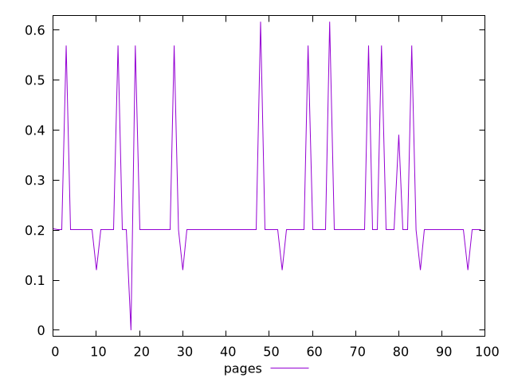
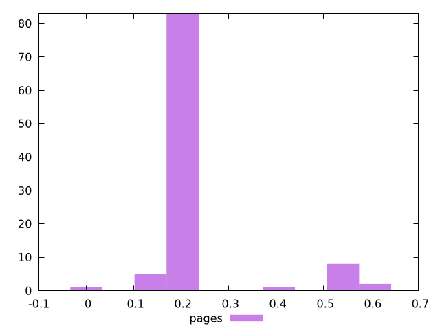
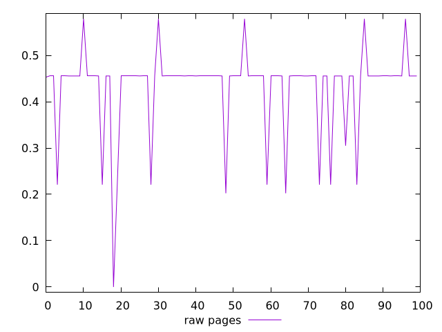
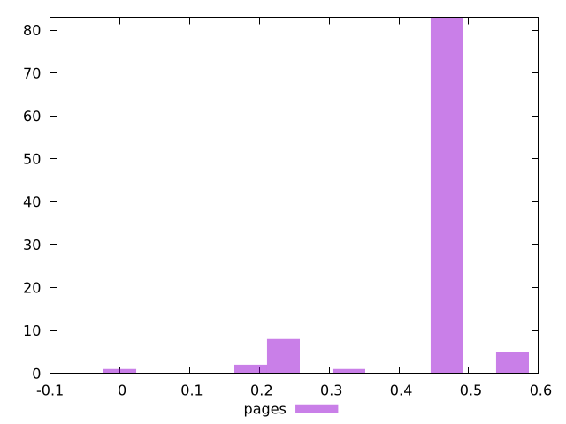

# Report pages

[parent..](./..)  


## Scores

  

## Score Histogram

  

## Score Indicators

```yaml
min: 0
max: 0.6165554185094355
range: 0.6165554185094355
mean: 0.2343048215652473
median: 0.20063339692915655
stdev: 0.11943437134679333
skewness: 2.299674746083138

```

## Raw Values

  

## Raw Values Histogram

  

## Raw Indicators

```yaml
min: 0
max: 0.5789043627844916
range: 0.5789043627844916
mean: 0.43181759171803813
median: 0.455589260313246
stdev: 0.0905040244747738
skewness: -2.224397987589455

```

<style>
  img {
    max-width: 80%;
  }
</style>
      
