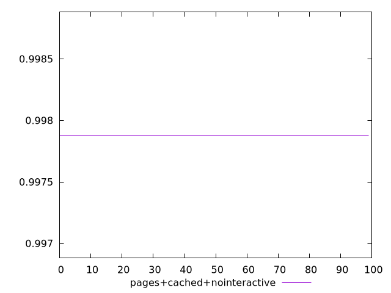
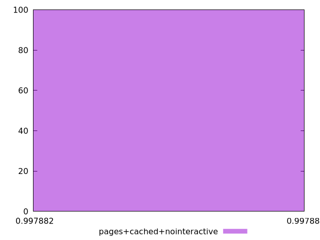
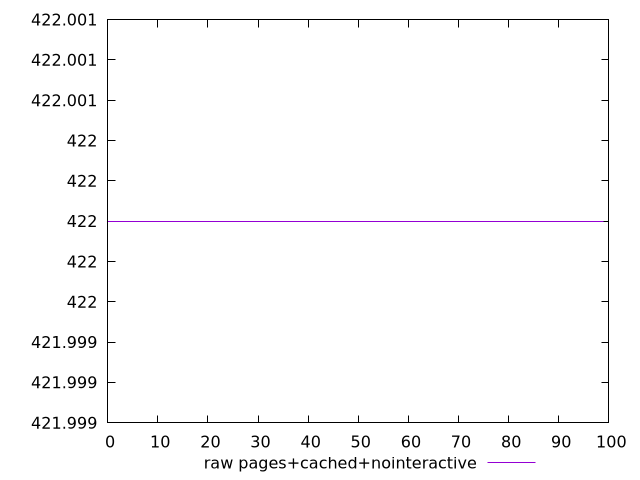
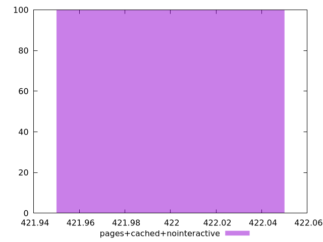

# Report pages+cached+nointeractive

[parent..](./..)  


## Scores

  

## Score Histogram

  

## Score Indicators

```yaml
min: 0.9978817385378554
max: 0.9978817385378554
range: 0
mean: 0.9978817385378561
median: 0.9978817385378554
stdev: 6.661338147750939e-16
skewness: -1

```

## Raw Values

  

## Raw Values Histogram

  

## Raw Indicators

```yaml
min: 422
max: 422
range: 0
mean: 422
median: 422
stdev: 0
skewness: .nan

```

<style>
  img {
    max-width: 80%;
  }
</style>
      
