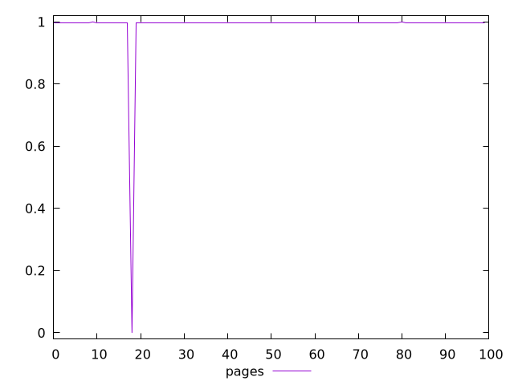
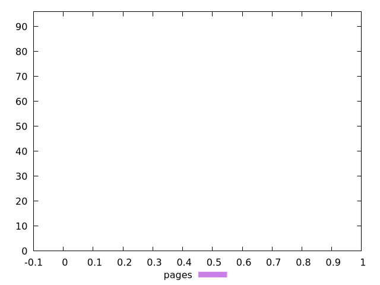
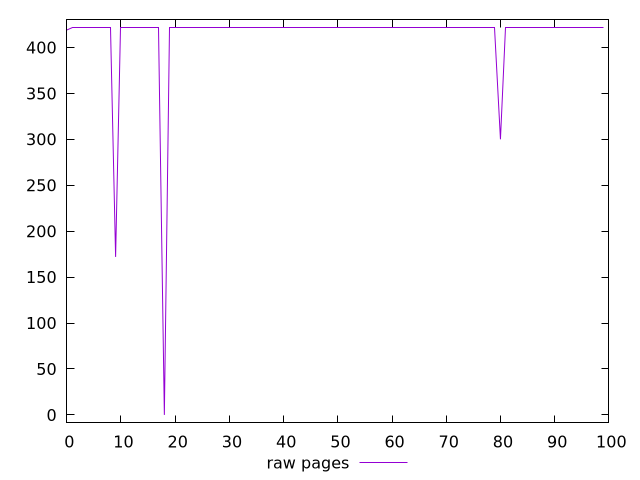
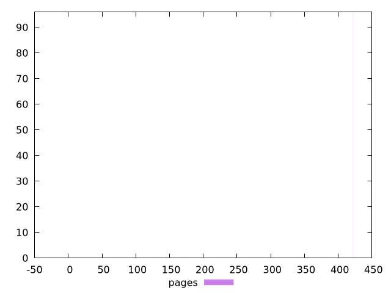

# Report pages

[parent..](./..)  


## Scores

  

## Score Histogram

  

## Score Indicators

```yaml
min: 0
max: 0.9999997135746177
range: 0.9999997135746177
mean: 0.9879451974294343
median: 0.9978817385378554
stdev: 0.09929264686998371
skewness: -9.849243314284642

```

## Raw Values

  

## Raw Values Histogram

  

## Raw Indicators

```yaml
min: 0
max: 422
range: 422
mean: 414.03
median: 422
stdev: 49.91241428742953
skewness: -6.963338895865645

```

<style>
  img {
    max-width: 80%;
  }
</style>
      
