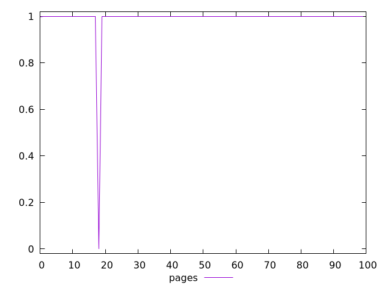
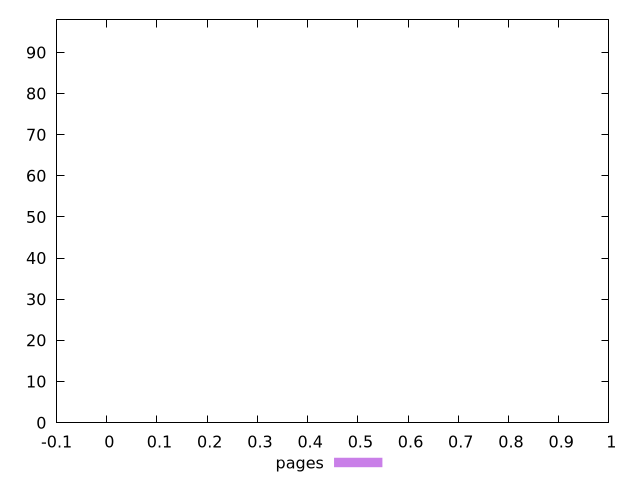
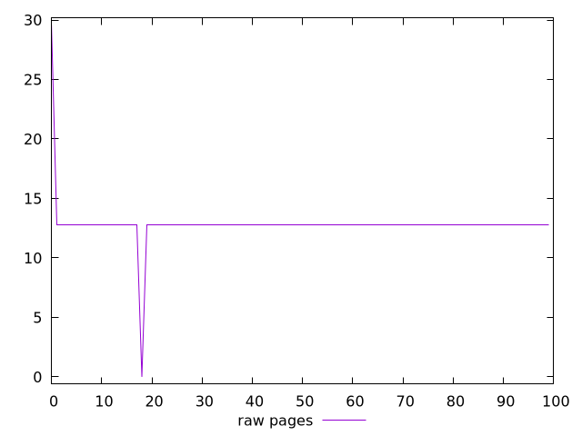
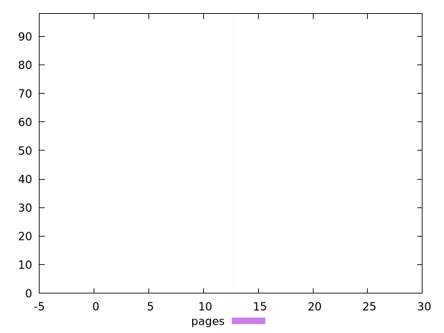

# Report pages

[parent..](./..)  


## Scores

  

## Score Histogram

  

## Score Indicators

```yaml
min: 0
max: 0.9999993380488856
range: 0.9999993380488856
mean: 0.9899784411322428
median: 0.9999993380488856
stdev: 0.09949679432901594
skewness: -9.849304809824666

```

## Raw Values

  

## Raw Values Histogram

  

## Raw Indicators

```yaml
min: 0
max: 29.6
range: 29.6
mean: 12.839999999999975
median: 12.8
stdev: 2.1116817942104817
skewness: 2.751539917199123

```

<style>
  img {
    max-width: 80%;
  }
</style>
      
