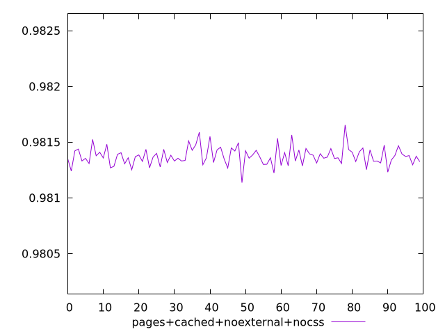
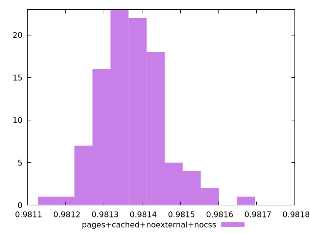
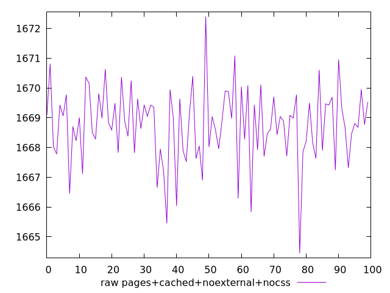
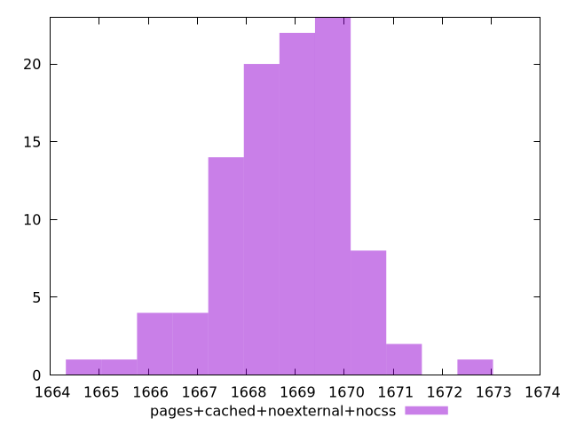

# Report pages+cached+noexternal+nocss

[parent..](./..)  


## Scores

  

## Score Histogram

  

## Score Indicators

```yaml
min: 0.9811363454930131
max: 0.9816536547949903
range: 0.0005173093019772423
mean: 0.9813745324479196
median: 0.9813665529248539
stdev: 0.00008258224725390105
skewness: 0.46262935943100525

```

## Raw Values

  

## Raw Values Histogram

  

## Raw Indicators

```yaml
min: 1664.4463999999998
max: 1672.4022
range: 7.955800000000181
mean: 1668.7558310000002
median: 1668.88035
stdev: 1.2699592138092377
skewness: -0.47539845852735463

```

<style>
  img {
    max-width: 80%;
  }
</style>
      
