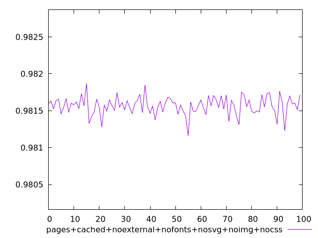
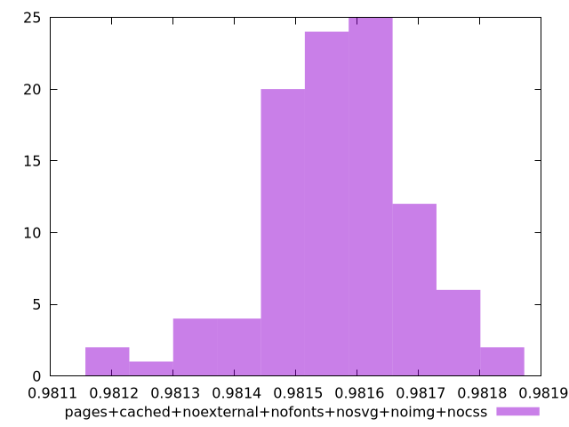
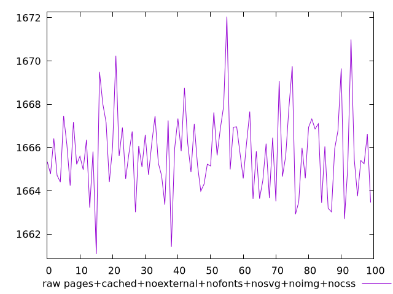
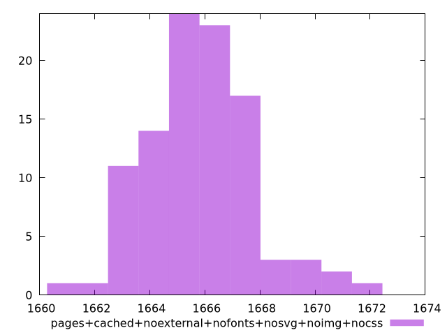

# Report pages+cached+noexternal+nofonts+nosvg+noimg+nocss

[parent..](./..)  


## Scores

  

## Score Histogram

  

## Score Indicators

```yaml
min: 0.9811595848353911
max: 0.9818696740710884
range: 0.0007100892356972643
mean: 0.9815668443299141
median: 0.9815701772768055
stdev: 0.00012369505553401982
skewness: -0.5051176956200216

```

## Raw Values

  

## Raw Values Histogram

  

## Raw Indicators

```yaml
min: 1661.0789999999997
max: 1672.0479999999998
range: 10.969000000000051
mean: 1665.7876719999997
median: 1665.7404499999998
stdev: 1.9121723497676488
skewness: 0.4871656282795941

```

<style>
  img {
    max-width: 80%;
  }
</style>
      
