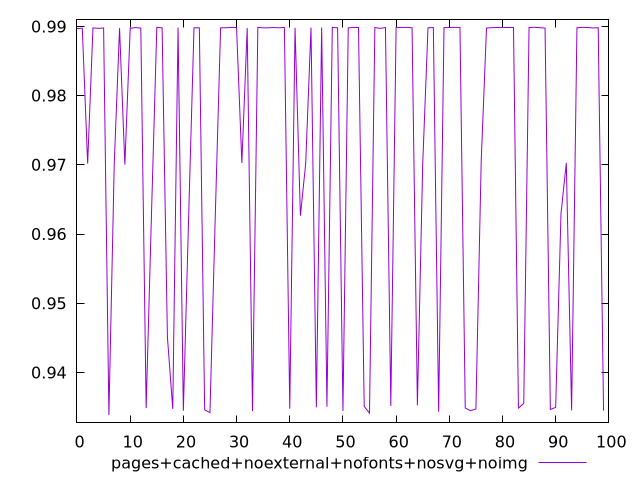
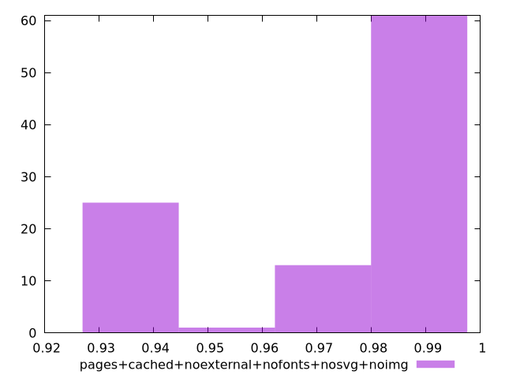
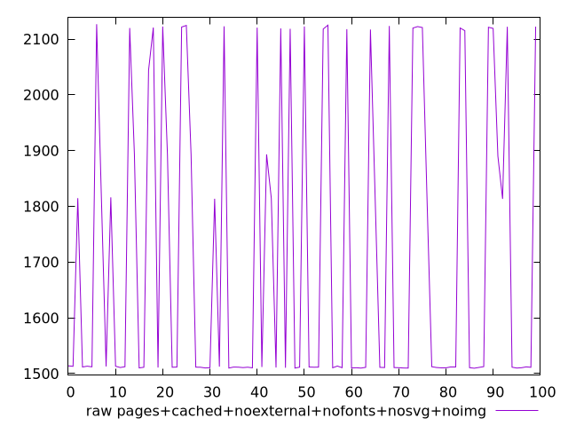
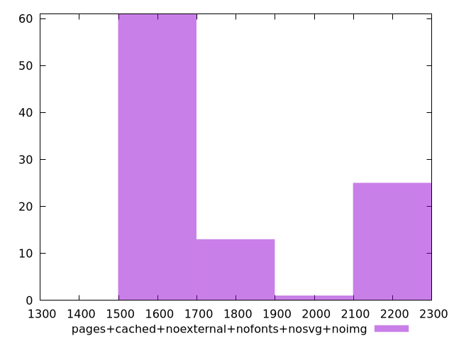

# Report pages+cached+noexternal+nofonts+nosvg+noimg

[parent..](./..)  


## Scores

  

## Score Histogram

  

## Score Indicators

```yaml
min: 0.9338674297618288
max: 0.9898776539087086
range: 0.05601022414687984
mean: 0.9726643452548857
median: 0.9897719267980251
stdev: 0.023509620857187215
skewness: -0.8367593499734842

```

## Raw Values

  

## Raw Values Histogram

  

## Raw Indicators

```yaml
min: 1509.6326000000001
max: 2126.6855499999997
range: 617.0529499999996
mean: 1712.263038
median: 1512.1102
stdev: 264.47824224117693
skewness: 0.6944969339797353

```

<style>
  img {
    max-width: 80%;
  }
</style>
      
