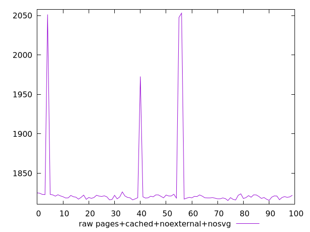

# Report pages+cached+noexternal+nosvg

[parent..](./..)  


## Scores

  

## Score Histogram

  

## Score Indicators

```yaml
min: 0.944006590960597
max: 0.970095407054824
range: 0.026088816094226974
mean: 0.9687684789955234
median: 0.9696837121890063
stdev: 0.00458222967820729
skewness: -4.894819112102597

```

## Raw Values

  

## Raw Values Histogram

  

## Raw Indicators

```yaml
min: 1815.4899
max: 2052.9345000000003
range: 237.44460000000026
mean: 1828.4910950000003
median: 1820.0919500000002
stdev: 41.96838487973685
skewness: 4.845615050421544

```

<style>
  img {
    max-width: 80%;
  }
</style>
      
