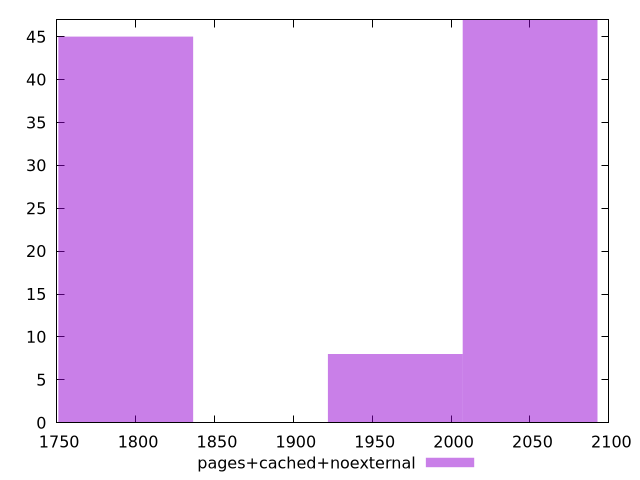

# Report pages+cached+noexternal

[parent..](./..)  


## Scores

  

## Score Histogram

  

## Score Indicators

```yaml
min: 0.9439247064149171
max: 0.9699561588510233
range: 0.02603145243610616
mean: 0.9565484663388361
median: 0.9535222004547792
stdev: 0.012130575220061533
skewness: 0.10496735927277978

```

## Raw Values

  

## Raw Values Histogram

  

## Raw Indicators

```yaml
min: 1817.0510000000002
max: 2053.5595500000004
range: 236.50855000000024
mean: 1940.2700349999996
median: 1976.2708499999999
stdev: 110.51600653595602
skewness: -0.1233576813900607

```

<style>
  img {
    max-width: 80%;
  }
</style>
      
